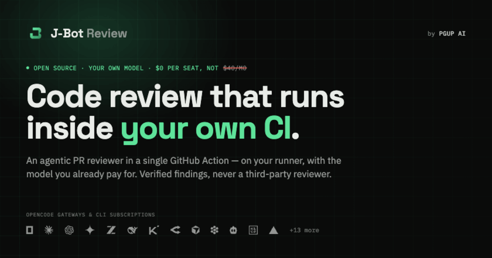

<p align="center">
  
</p>

# J-Bot Code Review

[](https://deepwiki.com/pgup-ai/jbot-review)

An agentic PR reviewer built on OpenCode. It runs as a GitHub Action: add one
workflow file and one secret, and every opened or updated pull request is reviewed
on your own GitHub Actions runner. The review core is `runner.ts` + `opencode.ts` +
`github.ts`.

## Image variants

The default `ghcr.io/pgup-ai/jbot-review:latest` includes every supported local
provider CLI. `:latest-slim` includes only **OpenCode, CommandCode and Devin**,
plus the same reviewer code and SDK dependencies. Existing workflows continue
using the full image. Review prompts, model selection and finding policy are
identical for supported routes.

Use `:<commit-sha>` (full) or `:<commit-sha>-slim` to pin a published revision;
`latest` and `latest-slim` track successful builds of main. Both variants are
published for Linux amd64. Build locally with `docker build --target slim .`;
a build without `--target` remains full.

Choose slim only when every model in the pool uses an included local runtime
or an SDK provider. Cursor, Codex and Kilo can also run through a configured
ACP gateway; their CLIs then live on the companion. An incompatible local
runtime fails pool validation before selection, with a message to use the full
image. No candidates are silently removed and no CLIs are installed on demand.

Direct Docker/Depot callers can select the image tag. The companion
`pgup-ai/jbot-review-action` change exposes `slim/action.yml` for GitHub Actions;
use that entry point only after the slim image and action version are published.

## In-repo workflow

The review runs as a Docker container action inside the user's GitHub Actions
runner. Users reference the thin [`pgup-ai/jbot-review-action`](https://github.com/pgup-ai/jbot-review-action) repo (just an `action.yml`); this repo builds the image it pulls.

### How it works

1. The user drops a workflow file into `.github/workflows/` and adds an API key
   as a repo secret.
2. On `pull_request` events, GitHub Actions checks out their repo and runs
   the `jbot-review` Docker container action.
3. The action pulls the pre-built image from `ghcr.io/pgup-ai/jbot-review`,
   starts `opencode serve` inside the container, and drives a read-only `plan`
   agent over the SDK. The agent discovers repo guidelines (`AGENTS.md`,
   `REVIEW.md`, `.pr-governance/`, and compatible review-bot rule files) and
   explores the full repo with its own tools.
4. The agent receives the PR's exact base...head diff scope and returns
   structured findings as JSON; the wrapper validates line anchors against the
   diff, demotes low-confidence blocking findings, gates by severity, and posts
   one review with inline comments + a deterministic verdict. Two parallel
   read-only sessions run alongside the main review: one audits the diff
   against discovered repository guidelines rule-by-rule, and one verifies
   which prior jbot-review threads the branch has addressed.

### For the action developer (you)

This repo builds the Docker image. The separate
[`pgup-ai/jbot-review-action`](https://github.com/pgup-ai/jbot-review-action)
repo is what users reference — it contains just the thin `action.yml` that
pulls the image.

```bash
# CI auto-builds and pushes the image on every push to main.
# To release a new v0 version of the public action:
# 1. Make sure ghcr.io/pgup-ai/jbot-review:latest exists and is public.
# 2. Make sure the public action.yml matches this repo's action.yml.
# 3. Move the v0 tag:
cd ../jbot-review-action    # or wherever it's checked out
git tag -f v0
git push origin v0 --force
```

The Dockerfile uses `node:24-slim` and runs the bundled JS from `dist/`.
The `v0` action reference is a moving major-version tag; pin to an immutable
release tag if you need fully stable action behavior.

> **The Action is one of several build entrypoints.** `scripts/build.ts` also
> bundles `src/worker/` and `src/app/` (for the separately-deployed control plane),
> but the Action runs only `dist/workflow/index.js`, and those paths share no
> imports — so worker/server changes can't affect Action users.
>
> The standalone worker's mirrored control-plane payload carries models and
> keys, but no custom base URL, so it does not support `openai-compatible` yet.
> Native providers, including `kimi-code-plan-global`, work there unchanged.

### For the user (repo owner who wants reviews)

**Step 1 — Add the workflow file.** Copy the full example from the
[`pgup-ai/jbot-review-action`](https://github.com/pgup-ai/jbot-review-action/blob/main/examples/jbot-review.yml)
repo into `.github/workflows/jbot-review.yml`, or use this minimal version:

```yaml
name: J-Bot Code Review
on:
  pull_request:
    types: [opened, reopened, ready_for_review, synchronize]

concurrency:
  group: jbot-review-${{ github.event.pull_request.number }}
  cancel-in-progress: true

permissions:
  contents: read
  packages: read
  pull-requests: write
  issues: write # optional: lets jbot post its review-done 🚀 reaction
  checks: read

jobs:
  review:
    if: github.event.pull_request.draft == false
    runs-on: ubuntu-latest
    steps:
      - uses: actions/checkout@v7
        with:
          fetch-depth: 0
      - uses: pgup-ai/jbot-review-action@v0 # moving v0 tag; pin a release tag for stability
        with:
          provider: ${{ vars.JBOT_REVIEW_PROVIDER || '' }}
          model: ${{ vars.JBOT_REVIEW_MODEL || '' }}
          sdk-engine: ${{ vars.JBOT_SDK_ENGINE || '' }}
          opencode-proxy-url: ${{ secrets.OPENCODE_PROXY_URL }}
          auto-approve: ${{ vars.JBOT_AUTO_APPROVE || 'false' }}
          opencode-api-key: ${{ secrets.OPENCODE_API_KEY }}
          deepseek-api-key: ${{ secrets.DEEPSEEK_API_KEY }}
          openai-api-key: ${{ secrets.OPENAI_API_KEY }}
          openai-compatible-api-key: ${{ secrets.JBOT_OPENAI_COMPATIBLE_API_KEY }}
          openai-compatible-base-url: ${{ vars.JBOT_OPENAI_COMPATIBLE_BASE_URL }}
          anthropic-api-key: ${{ secrets.ANTHROPIC_API_KEY }}
          gemini-api-key: ${{ secrets.GEMINI_API_KEY }}
          openrouter-api-key: ${{ secrets.OPENROUTER_API_KEY }}
          nvidia-api-key: ${{ secrets.NVIDIA_API_KEY }}
          zai-api-key: ${{ secrets.ZAI_API_KEY }}
          kimi-api-key: ${{ secrets.KIMI_API_KEY }}
          xai-api-key: ${{ secrets.XAI_API_KEY }}
          fireworks-api-key: ${{ secrets.FIREWORKS_API_KEY }}
          mimo-api-key: ${{ secrets.MIMO_API_KEY }}
          tokenrouter-api-key: ${{ secrets.TOKENROUTER_API_KEY }}
          devin-windsurf-api-key: ${{ secrets.DEVIN_WINDSURF_API_KEY }}
          commandcode-access-key: ${{ secrets.COMMANDCODE_ACCESS_KEY }}
          cursor-api-key: ${{ secrets.CURSOR_API_KEY }}
          poolside-api-key: ${{ secrets.POOLSIDE_API_KEY }}
          qoder-token: ${{ secrets.QODER_PERSONAL_ACCESS_TOKEN }}
          codex-auth: ${{ secrets.CODEX_AUTH_JSON }}
          cline-auth: ${{ secrets.CLINE_AUTH_JSON }}
          grok-auth: ${{ secrets.GROK_AUTH_JSON }}
          kilo-auth: ${{ secrets.KILO_AUTH_CONTENT }}
          enable-context7: auto
          context7-api-key: ${{ secrets.CONTEXT7_API_KEY }}
          github-token: ${{ secrets.GITHUB_TOKEN }}
          thread-resolution-token: ${{ secrets.JBOT_REVIEW_THREAD_RESOLUTION_TOKEN }}
```

The minimal version reviews every push. The full example also supports
**one-off reviews** — comment
`/jbot [--provider=<id>] [--model=<id>] [--auto-approve[=true|false]]` on a PR
(repo owners/members/collaborators only) to re-run the review once with
overrides, e.g. `/jbot --model=devin/glm-5.2 --auto-approve` — the model's
provider segment picks the backend, so `--provider` is only needed for the
legacy pinning behavior.
Bare `--auto-approve` is equivalent to `--auto-approve=true`; explicit `false`
overrides an enabled repository default for that run. Semantics — fallbacks,
fork policy, `workflow_dispatch` parity — are documented in
[`pgup-ai/jbot-review-action`](https://github.com/pgup-ai/jbot-review-action#one-off-reviews-jbot).

**Step 2 — Add provider API keys as secrets.** In the repo: Settings → Secrets
and variables → Actions → New repository secret. Add the keys for the providers
you want to use, such as `OPENCODE_API_KEY`, `DEEPSEEK_API_KEY`, `OPENAI_API_KEY`,
`GEMINI_API_KEY`, `OPENROUTER_API_KEY`, `NVIDIA_API_KEY`, `ZAI_API_KEY`, `KIMI_API_KEY`,
`XAI_API_KEY`, `FIREWORKS_API_KEY`, `MIMO_API_KEY`, `TOKENROUTER_API_KEY`, `DEVIN_WINDSURF_API_KEY`,
`COMMANDCODE_ACCESS_KEY`, `CURSOR_API_KEY`, `POOLSIDE_API_KEY`, `QODER_PERSONAL_ACCESS_TOKEN`, `CODEX_AUTH_JSON`,
`CLINE_AUTH_JSON`, `GROK_AUTH_JSON`, `KILO_AUTH_CONTENT`, `ANTHROPIC_API_KEY`, or
`JBOT_OPENAI_COMPATIBLE_API_KEY`. Configure `JBOT_OPENAI_COMPATIBLE_BASE_URL`
as an Actions variable when using the generic `openai-compatible` provider.
Empty provider key inputs are ignored; an auxiliary model on a different
provider needs that provider's own key, which is never reused across providers.
`opencode-go` uses the same `OPENCODE_API_KEY` as `opencode`; comma-separate
several of them and each run picks the account with the most weekly Go-plan
allowance left, the same way CommandCode keys are chosen. Unlike CommandCode a
spent plan is not fatal on its own: accounts that bill overage to the credit
balance keep serving and are preferred, while one with overage blocked is
picked only when nothing else is left, and its requests can still fail. Ranking
needs keys with the console's `all` permission — an inference-only key cannot
read plan meters, and its probe degrades to "usage unavailable" rather than
failing.

**CLI-backend credentials — where to get each one.** Unlike the model-provider keys
above, these authenticate with a local CLI login or a dashboard key. You paste the
**whole file** (for example, Codex, Cline, Grok Build) or the **key value** (for
example, Cursor, Devin, Command Code) — no digging a field out of JSON.

| Backend          | Get the credential                                                                                                                                                                                                | Secret (Action input)                                            |
| ---------------- | ----------------------------------------------------------------------------------------------------------------------------------------------------------------------------------------------------------------- | ---------------------------------------------------------------- |
| **Codex CLI**    | `codex login` (ChatGPT Plus/Pro) → paste the whole `~/.codex/auth.json`                                                                                                                                           | `CODEX_AUTH_JSON` (`codex-auth`)                                 |
| **Cline**        | `cline auth` → paste the whole `~/.cline/data/settings/providers.json`                                                                                                                                            | `CLINE_AUTH_JSON` (`cline-auth`)                                 |
| **Grok Build**   | `grok login --device-auth` → paste `~/.grok/auth.json`; alternatively create an xAI API key                                                                                                                       | `GROK_AUTH_JSON` (`grok-auth`), or `XAI_API_KEY` (`xai-api-key`) |
| **Cursor**       | Create a key at [cursor.com/dashboard/integrations](https://cursor.com/dashboard/integrations) → paste it (`crsr_…`)                                                                                              | `CURSOR_API_KEY` (`cursor-api-key`)                              |
| **Qoder CLI**    | Create a Personal Access Token under [Qoder Integrations](https://qoder.com/account/integrations)                                                                                                                 | `QODER_PERSONAL_ACCESS_TOKEN` (`qoder-token`)                    |
| **Devin**        | `devin auth login` → copy `windsurf_api_key` (`devin-session-token$…`) from `~/.local/share/devin/credentials.toml` ([docs](https://docs.devin.ai/cli))                                                           | `DEVIN_WINDSURF_API_KEY` (`devin-windsurf-api-key`)              |
| **Command Code** | Create an access key at [commandcode.ai](https://commandcode.ai/docs/quickstart) (`user_…`; the `apiKey` in `~/.commandcode/auth.json`) → paste it; comma-separate multiple keys for a balance-aware per-run pick | `COMMANDCODE_ACCESS_KEY` (`commandcode-access-key`)              |
| **Kilo**         | `kilo auth login` → paste the whole `~/.local/share/kilo/auth.json`                                                                                                                                               | `KILO_AUTH_CONTENT` (`kilo-auth`)                                |

Each CLI backend runs **read-only** and only when the main or aux model names
it. Cline and Command Code write their credential into an
isolated temporary `HOME`, Codex into a temporary `CODEX_HOME`, and Qoder carries
its PAT through a one-time SDK auth payload while using a temporary `HOME`; each is
removed after the run. Cursor reads its key straight from the env (no file); Devin writes
`~/.local/share/devin/credentials.toml` under a separate temporary `HOME` per CLI
invocation, removed after its process exits. Cline uses only
the auth token — the file's `model`/`reasoning` are stripped — and has two billing
modes sharing one secret: `cline` (pay-as-you-go) and `cline-pass` (Cline
subscription). Kilo reads its credential from the `KILO_AUTH_CONTENT` env var (no
file written) with an isolated temporary `HOME`/`XDG_DATA_HOME` per session,
removed after the run; it defaults to the free `kilo/kilo-auto/free` gateway
model.

Poolside uses its OpenAI-compatible chat-completions endpoint directly. Laguna
S 2.1 is absent from Poolside's advertised model list, but the endpoint accepts
`poolside/laguna-s-2.1` explicitly, so J-Bot uses it by default. Requests stream
directly, use Poolside's full 32,768-token completion allowance, and leave
reasoning at Poolside's default unless `model-options.reasoningEffort` overrides
it. This avoids the Pool CLI's coding-agent loop while preserving review,
auxiliary, token usage, timeouts, and repair behavior.

Qoder can read and search the checkout but receives no shell or write-capable tool.
Its user/project settings, hooks, MCP servers, skills, memory, web access, and
subagents are disabled. The complete diff is embedded with no byte ceiling, as
for every other shell-free backend: a file dropped to fit a budget would never
be reviewed at all, so coverage is never traded for prompt size. Auxiliary
sessions fail open as usual.

`grok` is an opt-in Grok Build CLI backend and is intentionally separate from
`xai`: existing `provider: xai` configurations continue using `XAI_API_KEY`
through the SDK engine unchanged. For `provider: grok`, account auth is preferred
when both credentials are configured; the API key is passed only when account
auth is absent, so an expired login cannot silently switch to paid API usage.
Grok Build runs headlessly with edits, shell,
MCP, web access, memory, and subagents disabled. It receives the budgeted review
prompt in an empty read-only temporary workspace, so repository Grok config,
plugins, and hooks cannot execute. To preserve full-diff coverage without checkout
access, jbot-review embeds every changed file whole at any shard count, including
one; an oversized PR fails at the provider rather than being reviewed in part.
Sessions are serialized through one per-run temporary Grok home, removed after
the run. With account auth, this lets credential rotations persist without
concurrent writes. Whether a rotated refresh token from one ephemeral
GitHub-hosted run can be reused from the original `GROK_AUTH_JSON` secret on the
next run is not yet a documented xAI contract. Treat repeated hosted-run auth as
unresolved during dogfood; jbot-review never logs or exports the rotated
credential.
The CLI account's availability, quota, and acceptable-use terms remain controlled
by xAI; dogfood with `provider: grok`, `model: grok/default`, and conservative
concurrency before wider use.

Add `CONTEXT7_API_KEY` only if you want docs lookup for external API, SDK,
framework, CLI, cloud-service, or workflow changes.

**Secret exposure:** the example above passes multiple provider secrets so
`JBOT_REVIEW_MODEL` can switch providers without another YAML edit. For a least-privilege setup, pass only the selected provider
keys:

```yaml
with:
  model: opencode/deepseek-v4-flash,openrouter/google/gemini-2.5-flash
  opencode-api-key: ${{ secrets.OPENCODE_API_KEY }}
  openrouter-api-key: ${{ secrets.OPENROUTER_API_KEY }}
  github-token: ${{ secrets.GITHUB_TOKEN }}
```

**Thread resolution token:** when jbot verifies a prior finding is fixed, it
posts an addressed reply and then attempts to resolve the GitHub review thread.
Once every finding in a review is represented by a resolved thread, the run that
resolves the final thread (or the next run after a manual resolution) compacts
its stale summary, keeps the original body under a disclosure, and minimizes the
submitted review as resolved.
Some `GITHUB_TOKEN` integrations can post review comments but cannot run
GitHub's `resolveReviewThread` or `minimizeComment` mutation. If you see
`Resource not accessible by integration` in the logs, add a secret such as
`JBOT_REVIEW_THREAD_RESOLUTION_TOKEN` with a PAT or GitHub App token that can
manage PR reviews, then pass it through `thread-resolution-token`.

**Step 3 — (Optional) Add review guidelines.** Drop an `AGENTS.md`, `REVIEW.md`,
`.cursor/BUGBOT.md`, `.coderabbit.yaml`, `greptile.json`, or
`.pr-governance/README.md` at the repo root. The agent reads these during review.
Markdown docs referenced from those files are preloaded into the review context
(within the guidance byte budget); anything beyond the budget is listed as an
available path the agent can read on demand.

**Step 4 — Open a PR.** The review runs automatically. To re-trigger, push a
new commit or close and reopen the PR.

**Migrating from `api-key`:** replace the old unified `api-key` input with the
matching provider-specific input, such as `opencode-api-key` for
`provider: opencode`. The unified input is not read by current `v0` builds.

### Testing locally before publishing

This repo's own `.github/workflows/jbot-review.yml` dogfoods branch-local action
changes before they are published to `pgup-ai/jbot-review-action@v0`. It builds
the branch image, uses the relative `./` action, and passes every provider key
input so `JBOT_REVIEW_MODEL` can switch providers without editing the workflow.

```yaml
- uses: actions/checkout@v7
  with:
    fetch-depth: 0
    ref: ${{ github.event.pull_request.head.sha || format('refs/pull/{0}/head', inputs['pr-number']) }}
- uses: actions/setup-node@v6
  with:
    node-version: '24'
- run: npm ci
- run: npm run build
- run: docker build -t ghcr.io/pgup-ai/jbot-review:latest .
- uses: ./
  with:
    provider: ${{ inputs.provider || vars.JBOT_REVIEW_PROVIDER || '' }}
    model: ${{ inputs.model || vars.JBOT_REVIEW_MODEL || '' }}
    sdk-engine: ${{ vars.JBOT_SDK_ENGINE || '' }}
    opencode-proxy-url: ${{ secrets.OPENCODE_PROXY_URL }}
    pr-number: ${{ github.event.pull_request.number || inputs['pr-number'] }}
    dry-run: ${{ inputs['dry-run'] || 'false' }}
    auto-approve: ${{ vars.JBOT_AUTO_APPROVE || 'false' }}
    max-findings: ${{ inputs['max-findings'] || '0' }}
    min-severity: ${{ inputs['min-severity'] || 'nit' }}
    include-prior-comments: ${{ inputs['include-prior-comments'] || 'true' }}
    fail-on-error: ${{ inputs['fail-on-error'] || 'true' }}
    opencode-api-key: ${{ secrets.OPENCODE_API_KEY }}
    deepseek-api-key: ${{ secrets.DEEPSEEK_API_KEY }}
    openai-api-key: ${{ secrets.OPENAI_API_KEY }}
    openai-compatible-api-key: ${{ secrets.JBOT_OPENAI_COMPATIBLE_API_KEY }}
    openai-compatible-base-url: ${{ vars.JBOT_OPENAI_COMPATIBLE_BASE_URL }}
    anthropic-api-key: ${{ secrets.ANTHROPIC_API_KEY }}
    gemini-api-key: ${{ secrets.GEMINI_API_KEY }}
    openrouter-api-key: ${{ secrets.OPENROUTER_API_KEY }}
    nvidia-api-key: ${{ secrets.NVIDIA_API_KEY }}
    zai-api-key: ${{ secrets.ZAI_API_KEY }}
    kimi-api-key: ${{ secrets.KIMI_API_KEY }}
    xai-api-key: ${{ secrets.XAI_API_KEY }}
    fireworks-api-key: ${{ secrets.FIREWORKS_API_KEY }}
    mimo-api-key: ${{ secrets.MIMO_API_KEY }}
    tokenrouter-api-key: ${{ secrets.TOKENROUTER_API_KEY }}
    devin-windsurf-api-key: ${{ secrets.DEVIN_WINDSURF_API_KEY }}
    commandcode-access-key: ${{ secrets.COMMANDCODE_ACCESS_KEY }}
    cursor-api-key: ${{ secrets.CURSOR_API_KEY }}
    poolside-api-key: ${{ secrets.POOLSIDE_API_KEY }}
    qoder-token: ${{ secrets.QODER_PERSONAL_ACCESS_TOKEN }}
    grok-auth: ${{ secrets.GROK_AUTH_JSON }}
    kilo-auth: ${{ secrets.KILO_AUTH_CONTENT }}
    enable-context7: auto
    context7-api-key: ${{ secrets.CONTEXT7_API_KEY }}
    github-token: ${{ secrets.GITHUB_TOKEN }}
    thread-resolution-token: ${{ secrets.JBOT_REVIEW_THREAD_RESOLUTION_TOKEN }}
```

### Review quality controls

Every run reviews the complete base...head diff (never just the latest
commit); repeats of findings already covered by prior jbot threads are
suppressed in code before posting. Several inputs tune the recall/precision/cost
balance:

**Posting behavior.** The first visible run on a PR always posts a review
(baseline), and any run that finds something posts. A clean re-run posts no
comment. With `auto-approve: true`, a clean run approves the exact reviewed
head only when every prior jbot thread is resolved and GitHub reports the PR
open, non-draft, and mergeable. CI, required reviews, and every other merge
requirement remain GitHub's responsibility. Jbot never submits a blocking
`REQUEST_CHANGES` review or calls the review-dismissal API. To keep an older
approval from covering a new head, repositories must require approval of the
most recent reviewable push. That rule does not invalidate an approval when a
same-head re-run finds new or open findings; repositories that need those
findings to block merge must enforce a separate manual or workflow safeguard.
The 🚀 reaction means **the PR has
no open jbot findings** — it is
added only when a real review leaves zero new findings _and_ every prior
finding thread is resolved, and removed when a review starts. So 🚀-present
means "reviewed, all good"; 🚀-absent means a review is in flight or the PR
has open findings. Addressed-thread replies and resolution always run
regardless. A docs/diagram-only PR — or a push that leaves the diff
byte-identical to the last posted review, typically an "Update branch" merge
from main (see `skip-doc-only` / `skip-unchanged`) — is skipped before any
model call and leaves the reaction unchanged (it isn't reviewed, so it
neither earns nor loses the 🚀). _Reactions are best-effort: if they don't
appear, grant the workflow `issues: write` (PR reactions use the issues API);
the review itself is unaffected._

| Input                     | Default            | Effect                                                                                                                                                                                                                                                                                                                                                                                                                                                                                                                                                                                                                                                                                                                                                                                                                                                                                                                                                                                                                                                                                                                                                                                                                                                                                                                                                                                                                                                                                                                                                                      |
| ------------------------- | ------------------ | --------------------------------------------------------------------------------------------------------------------------------------------------------------------------------------------------------------------------------------------------------------------------------------------------------------------------------------------------------------------------------------------------------------------------------------------------------------------------------------------------------------------------------------------------------------------------------------------------------------------------------------------------------------------------------------------------------------------------------------------------------------------------------------------------------------------------------------------------------------------------------------------------------------------------------------------------------------------------------------------------------------------------------------------------------------------------------------------------------------------------------------------------------------------------------------------------------------------------------------------------------------------------------------------------------------------------------------------------------------------------------------------------------------------------------------------------------------------------------------------------------------------------------------------------------------------------- |
| `auto-approve`            | `false`            | Approve the exact reviewed head when the run produces no findings before display filters, all prior jbot threads are resolved, and GitHub reports the PR open, non-draft, and mergeable. Existing same-head jbot approvals are not duplicated. GitHub branch protection still decides whether the PR can merge.                                                                                                                                                                                                                                                                                                                                                                                                                                                                                                                                                                                                                                                                                                                                                                                                                                                                                                                                                                                                                                                                                                                                                                                                                                                             |
| `review-passes`           | `1`                | Total review passes (1–3). Passes beyond the first add focused recall lenses (cross-hunk interactions, then security/data-integrity) in parallel on the aux model; findings merge and dedupe. Raise to 2-3 for maximum recall.                                                                                                                                                                                                                                                                                                                                                                                                                                                                                                                                                                                                                                                                                                                                                                                                                                                                                                                                                                                                                                                                                                                                                                                                                                                                                                                                              |
| `dynamic-fanout`          | `true`             | Scale the recall-supplement fan-out (extra lens passes + the guideline-compliance pass) to the diff's risk and size: a small, low-risk change (≤3 files, ≤60 added lines, no security/data/API/infra path or build/CI tooling like `package.json`/`action.yml`/workflows, no dependency-manifest change, no large deletion) runs the general pass only and skips the guideline pass; everything else runs the full requested fan-out. The requested config is the ceiling — this only ever reduces it, and never gates the main full-diff review or `verify-findings`. Set `false` to force the full requested fan-out on every PR.                                                                                                                                                                                                                                                                                                                                                                                                                                                                                                                                                                                                                                                                                                                                                                                                                                                                                                                                         |
| `verify-findings`         | `true`             | All findings, including P3 and nits, are adversarially re-checked before posting, with blocking findings first. Refuted findings are dropped; uncertain findings remain unverified advisories.                                                                                                                                                                                                                                                                                                                                                                                                                                                                                                                                                                                                                                                                                                                                                                                                                                                                                                                                                                                                                                                                                                                                                                                                                                                                                                                                                                              |
| `review-shards`           | `1`                | Parallel shards for the main review. `1` = no sharding, one full-diff session (default). `0` = auto from diff size, capped at 4. `N` = pin N shards. Sharding only speeds review up on providers that serve concurrent sessions; on free/throttled tiers the shards serialize on one key (see `max-concurrent-sessions`), so single-session is the better default. Either way the review covers the complete diff; raise it on paid concurrent tiers, or for very large PRs where smaller per-shard context helps depth.                                                                                                                                                                                                                                                                                                                                                                                                                                                                                                                                                                                                                                                                                                                                                                                                                                                                                                                                                                                                                                                    |
| `time-budget-minutes`     | `30`               | Wall-clock target (`0` = no budget). Finder sessions reserve 30s for posting and up to 5min for enabled verification (at most half the usable budget); shard retries and verification use whatever remains, or are skipped (fail-open). After main review, parallel auxiliary passes get up to five more minutes, limited by the remaining budget with 30s reserved for posting and up to 5min for enabled verification. An auxiliary session (lens, addressed-thread, guideline, verification) over its deadline is aborted and fails open — degrading only its own coverage, never the run. A main review shard that still fails after its retry aborts the run rather than posting partial coverage.                                                                                                                                                                                                                                                                                                                                                                                                                                                                                                                                                                                                                                                                                                                                                                                                                                                                     |
| `max-concurrent-sessions` | `3`                | Max model sessions in flight (`0` = unlimited). Free/throttled tiers serialize one key's requests upstream — observed as a flash session queued 7+ minutes behind parallel shards. The capped default keeps each session's deadline measuring model time, not queue time; drop to `2` on tight free tiers, or set `0` on paid tiers with real concurrency.                                                                                                                                                                                                                                                                                                                                                                                                                                                                                                                                                                                                                                                                                                                                                                                                                                                                                                                                                                                                                                                                                                                                                                                                                  |
| `model-options`           | provider-dependent | JSON object of provider options for the main model. Native providers default to `{"reasoningEffort":"medium"}`; Poolside uses `{"reasoningEffort":"default"}` to leave reasoning provider-managed; custom providers default to `{}` because arbitrary endpoints may reject unknown options. Explicit values are preserved. Governs the main model only. An auxiliary session running a model of its own gets the same treatment one tier lower, since it sits on the tail of the run: `{"reasoningEffort":"low"}` on native providers, `{"reasoningEffort":"default"}` on Poolside, `{}` on custom ones. An auxiliary session drawing the main model shares its entry and its effort — on every engine: pi levels are per session, so a distinct aux model on a shared pi runtime takes the aux effort. CommandCode sessions map `reasoningEffort` onto the CLI `--effort` flag from a per-model allowlist in code: default options deliver medium to the main session and low to auxiliary ones wherever the model declares that tier (the DeepSeek flash models have no medium: v4.1-flash and v4-flash-fast fall back to low, v4-flash to high, since a tool-less review gains nothing from deeper reasoning), an explicitly-set effort clamps to the nearest declared tier, and undeclared models keep the CLI default. Finding verification on every backend runs one tier below the main session (never below low), rounding down where its model lacks that tier. Other CLI backends do not consume model options — on Devin, effort is part of the model id itself. |
| `prompt-cache`            | `true`             | Enable opencode prompt caching (provider `setCacheKey`). Parallel shards and re-reviews of the same PR share a byte-identical prompt prefix, so caching cuts input-token cost on models that honor it; models marked unsupported by capability metadata omit the cache key entirely. Each session logs a `tokens: …` line with `cache(read=… write=…)` — `read > 0` on a later shard or re-review confirms a hit. Mostly matters on paid tiers.                                                                                                                                                                                                                                                                                                                                                                                                                                                                                                                                                                                                                                                                                                                                                                                                                                                                                                                                                                                                                                                                                                                             |
| `skip-doc-only`           | `true`             | Skip the full review (no model call) when the entire PR diff is documentation, prose, or diagram assets (`.md`, `.mdx`, `.markdown`, `.rst`, `.adoc`, `.txt`, `.pdf`, `.svg`, `.drawio`, `.dio`, `.excalidraw`, `.mmd`, `.puml`, `.plantuml`); the reaction is left unchanged (a docs push doesn't change the verdict). Evaluated on the **reviewable** file set (noise like lockfiles and patchless/binary files are excluded — the bot never reviews those anyway, so the skip never drops review coverage); any reviewable code/config file forces a full review. Set `false` to always review, e.g. for docs with embedded code samples you care about.                                                                                                                                                                                                                                                                                                                                                                                                                                                                                                                                                                                                                                                                                                                                                                                                                                                                                                                 |
| `skip-unchanged`          | `true`             | Skip the full review (no model call) when the merge-base-relative patch set is byte-identical to the one the last posted jbot review covered — the common "Update branch" merge from main. Anything uncertain (no completion footer on the latest review, incomplete coverage, compare failure or its 300-file cap, binary/patchless files) fails open to a full review, and comment-triggered, manually dispatched, or `auto-approve` runs always review (approval must re-attest the newest head). Set `false` to review every push.                                                                                                                                                                                                                                                                                                                                                                                                                                                                                                                                                                                                                                                                                                                                                                                                                                                                                                                                                                                                                                      |
| `review-telemetry`        | `true`             | Write per-finding disposition + per-session token telemetry to the gitignored `.jbot-review/telemetry.jsonl` (uploaded as a CI artifact by the dogfood workflow). Near-zero overhead; `false` disables.                                                                                                                                                                                                                                                                                                                                                                                                                                                                                                                                                                                                                                                                                                                                                                                                                                                                                                                                                                                                                                                                                                                                                                                                                                                                                                                                                                     |
| `evidence-quotes`         | `true`             | Ask each finding for a verbatim quote of the changed line it flags. Grounds finding verification and lets a finding whose line anchor missed the diff be re-anchored to its quoted line instead of dropped. `false` restores the pre-evidence prompt byte-for-byte.                                                                                                                                                                                                                                                                                                                                                                                                                                                                                                                                                                                                                                                                                                                                                                                                                                                                                                                                                                                                                                                                                                                                                                                                                                                                                                         |

Incomplete auxiliary passes are named in the review report, including reruns with
no findings. These runs retain findings from completed passes but do not receive
an automatic approval or review-done reaction. CommandCode cancellation stops its
process tree and waits for output pipes to close before removing its temporary home.
Queued passes cancelled before execution never start a provider session.
Pi and tool-capable OpenCode verifiers can read and search repository evidence;
CommandCode verifiers can investigate when `JBOT_COMMANDCODE_TOOLS=true`.
Changes-since summaries receive up to 256 KiB
of delta diff plus a bounded file overview; larger deltas disclose summary-only
omissions. Main reviews continue to cover the full base-to-head diff.

**Prompt/context arms (env, not inputs).** `JBOT_EMBEDDED_FIRST_PROMPT` (on),
`JBOT_CONTEXT_TRIM` (off) and `JBOT_SHARED_PREFIX_PROMPT` (off) are set by
environment rather than action input; the [local review](#local-review) knob
list describes what each changes. Map them onto the `uses:` step to switch one
from a repo variable without editing a file:

```yaml
env:
  JBOT_CONTEXT_TRIM: ${{ vars.JBOT_CONTEXT_TRIM }}
  JBOT_EMBEDDED_FIRST_PROMPT: ${{ vars.JBOT_EMBEDDED_FIRST_PROMPT }}
  JBOT_SHARED_PREFIX_PROMPT: ${{ vars.JBOT_SHARED_PREFIX_PROMPT }}
```

Only the literal `true`/`false` count; anything else, including an unset
variable, takes the default above.

**Heavy-model recipe** (deep reviews from GPT‑5.x / Opus-class models with
longer timeout headroom): set the main `model` to the heavy tier, then

```yaml
model: ${{ vars.JBOT_REVIEW_MODEL }} # heavy tier first, then a fast tier for the aux draw
review-shards: '0' # opt into auto-sharding on a paid concurrent tier
max-concurrent-sessions: '0' # unlimited on a paid concurrent tier (default caps at 3)
# defaults already active: review-shards 1 (off), time-budget-minutes 30,
# model-options {"reasoningEffort":"medium"}; raise to high on paid heavy tiers.
```

On a paid tier with real session concurrency, sharding keeps each heavy session
small (one shard ≈ 24KB of diff), so reasoning time is bounded by the shard, not
the PR; a main shard that still fails after its retry aborts the run rather than
posting partial coverage (auxiliary sessions fail open and degrade only their
own coverage). On free/throttled tiers the shards serialize on one key, so the
default single session is both simpler and no slower — leave `review-shards` at
`1` there.

### Provider configuration (in-repo)

See the generated [model ID catalog](./MODEL_CATALOG.md) for every current
Models.dev ID and the model IDs exposed by each supported CLI. Refresh it with
`npm run models:update`; account-scoped CLI sections require those CLIs to be
authenticated locally. The generator uses the npm versions pinned in the
Docker image; Cursor comes from its vendor-installed binary, while Devin has no
enumerable catalog command and is documented as that explicit boundary.

**SDK engines.** Non-CLI providers run on one of two in-repo SDK engines,
chosen automatically per session role. The rule: a provider pi can also serve
routes to the in-process [pi SDK](https://pi.dev/docs/latest/sdk) first when pi's
catalog contains the selected model; catalog misses automatically stay on the
opencode server so newly released models do not fail while pi catches up. pi's
allowlist covers `anthropic`, `openai`,
`google`, `deepseek`, `xai`, `openrouter`,
`fireworks-ai`, `zai-coding-plan`, `xiaomi-token-plan-sgp`, `nvidia`, and the
`opencode`/`opencode-go` Zen gateways (which pi reaches over their HTTP
endpoint directly, not through the opencode server). The Kimi providers, `tokenrouter`, and
`openai-compatible` stay on opencode. Set the Action input `sdk-engine: opencode`
or, for hosted/local runs, `JBOT_SDK_ENGINE=opencode` to pin every SDK session
to opencode — the one-line rollback if pi misbehaves, and the path CLI backends'
aux sessions still use.
The pi engine requires Node >= 22.19 (the published Docker image runs Node 24); on older runtimes it
disables itself and logs why. pi sessions run hermetically (no user-level pi
config, skills, or prompt templates are loaded), get no shell (pi ships no
sandbox, so read-only is enforced by withholding `bash` rather than by
filtering it). `read_file` supports a starting line, `search_repo` finds literal
text in non-ignored files without following directory symlinks, and `git_diff` serves the reviewed change. All three return
up to 128 KiB per response with byte offsets for continuation; large files and
diffs remain fully accessible. Reads and searches stay inside the repository.
The provider catalog supplies each model's context window; tool-page size is a
response budget, not a model context-window override. Repository investigation has
no tool-call, total-output, distinct-file, repeat-read, or dependency-depth quota;
existing session deadlines and per-command process limits still apply. Pi manages
provider prompt caching natively, so `JBOT_PROMPT_CACHE` applies to opencode-served sessions only.

**CLI and ACP routing.** Without `JBOT_ACP_GATEWAY_URL`, `devin` runs through
its headless CLI from an isolated temporary workspace, with repository-controlled
Devin configuration excluded and a per-session permission config that denies
edit and write operations.
Setting that URL routes gateway-supported providers (`devin`, `cursor`,
`codex`, `kilo`) to a remote companion over the
[Agent Client Protocol](https://agentclientprotocol.com); the gateway token and
endpoint are then required. Remote read-only enforcement combines the ACP
permission policy with each agent's read-only configuration.
`cline` stays on its argv driver: its ACP mode currently returns empty turns
([cline/cline#11015](https://github.com/cline/cline/issues/11015)). The
opencode server engine keeps serving SDK providers directly — its ACP mode
would drop per-session token usage, provider model listing, and Context7 MCP.

Review metadata reports backend usage counters when they are available.
OpenCode-backed and Qoder sessions report token counters and cost from result
metadata. The ACP-driven backends (cursor/devin/codex) and the other CLI
backends do not report machine-readable per-session usage today, so those
sessions may be absent from the metadata block.
These counters are observability only: they do not identify API keys,
accounts, organizations, quota buckets, remaining quota, or reset times, so
jbot-review does not use them for smart key rotation.

| `provider`              | Default model                                                   | Action key input                | Secret/env var                       |
| ----------------------- | --------------------------------------------------------------- | ------------------------------- | ------------------------------------ |
| `opencode`              | `opencode/deepseek-v4-flash`                                    | `opencode-api-key`              | `OPENCODE_API_KEY`                   |
| `opencode-go`           | `opencode-go/deepseek-v4-flash`                                 | `opencode-api-key`              | `OPENCODE_API_KEY`                   |
| `deepseek`              | `deepseek/deepseek-v4-flash`                                    | `deepseek-api-key`              | `DEEPSEEK_API_KEY`                   |
| `openai`                | `openai/gpt-5.4-nano`                                           | `openai-api-key`                | `OPENAI_API_KEY`                     |
| `openai-compatible`     | required                                                        | `openai-compatible-api-key`     | `JBOT_OPENAI_COMPATIBLE_API_KEY`     |
| `anthropic`             | `anthropic/claude-sonnet-4-6`                                   | `anthropic-api-key`             | `ANTHROPIC_API_KEY`                  |
| `google`                | `google/gemini-2.5-flash`                                       | `gemini-api-key`                | `GEMINI_API_KEY`                     |
| `openrouter`            | `openrouter/openai/gpt-4o-mini`                                 | `openrouter-api-key`            | `OPENROUTER_API_KEY`                 |
| `nvidia`                | `nvidia/nemotron-3-ultra-550b-a55b`                             | `nvidia-api-key`                | `NVIDIA_API_KEY`                     |
| `zai-coding-plan`       | `zai-coding-plan/glm-5.2`                                       | `zai-api-key`                   | `ZAI_API_KEY`                        |
| `kimi-code-plan-global` | `kimi-code-plan-global/k3`                                      | `kimi-api-key`                  | `KIMI_API_KEY`                       |
| `kimi-code-plan-cn`     | `kimi-code-plan-cn/k3`                                          | `kimi-api-key`                  | `KIMI_API_KEY`                       |
| `xai`                   | `xai/grok-4.3`                                                  | `xai-api-key`                   | `XAI_API_KEY`                        |
| `fireworks-ai`          | `fireworks-ai/accounts/fireworks/models/deepseek-v4-flash-0731` | `fireworks-api-key`             | `FIREWORKS_API_KEY`                  |
| `xiaomi-token-plan-sgp` | `xiaomi-token-plan-sgp/mimo-v2.5-pro`                           | `mimo-api-key`                  | `MIMO_API_KEY`                       |
| `tokenrouter`           | `tokenrouter/z-ai/glm-5.3-free`                                 | `tokenrouter-api-key`           | `TOKENROUTER_API_KEY`                |
| `devin`                 | `devin/default`                                                 | `devin-windsurf-api-key`        | `DEVIN_WINDSURF_API_KEY`             |
| `commandcode`           | `commandcode/default`                                           | `commandcode-access-key`        | `COMMANDCODE_ACCESS_KEY`             |
| `cursor`                | `cursor/default`                                                | `cursor-api-key`                | `CURSOR_API_KEY`                     |
| `poolside`              | `poolside/laguna-s-2.1`                                         | `poolside-api-key`              | `POOLSIDE_API_KEY`                   |
| `qoder`                 | `qoder/auto`                                                    | `qoder-token`                   | `QODER_PERSONAL_ACCESS_TOKEN`        |
| `codex`                 | `codex/default`                                                 | `codex-auth`                    | `CODEX_AUTH_JSON`                    |
| `cline`                 | `cline/default`                                                 | `cline-auth`                    | `CLINE_AUTH_JSON`                    |
| `cline-pass`            | `cline-pass/default`                                            | `cline-auth`                    | `CLINE_AUTH_JSON`                    |
| `grok`                  | `grok/default`                                                  | `grok-auth`, then `xai-api-key` | `GROK_AUTH_JSON`, then `XAI_API_KEY` |
| `kilo`                  | `kilo/kilo-auto/free`                                           | `kilo-auth`                     | `KILO_AUTH_CONTENT`                  |

CommandCode checks remaining monthly plan credits for single keys and key lists. Exhausted plans are excluded from selection, even when purchased credits remain; if every reachable key is exhausted, the run stops before starting a review.

Use `provider: zai-coding-plan` with `zai-api-key` / `ZAI_API_KEY` for the
Z.AI GLM Coding Plan subscription endpoint.
Use `provider: kimi-code-plan-global` (kimi.ai) or `kimi-code-plan-cn`
(kimi.com) with `kimi-api-key` / `KIMI_API_KEY` for the native Models.dev Kimi
Coding Plan providers; pick the domain that issued the key. Their current
default is Kimi K3.

```yaml
provider: kimi-code-plan-global
kimi-api-key: ${{ secrets.KIMI_API_KEY }}
```

For an arbitrary OpenAI-compatible endpoint, set all three explicit values:

```yaml
provider: openai-compatible
model: openai-compatible/my-served-model
openai-compatible-api-key: ${{ secrets.JBOT_OPENAI_COMPATIBLE_API_KEY }}
openai-compatible-base-url: ${{ vars.JBOT_OPENAI_COMPATIBLE_BASE_URL }}
```

These namespaced settings never fall back to `OPENAI_API_KEY` or
`OPENAI_BASE_URL`, so the direct `openai` provider remains isolated. The model
is required because a generic endpoint has no safe provider-wide default.
For local review or the webhook app, the equivalent environment is:

```dotenv
MODEL=openai-compatible/my-served-model
JBOT_OPENAI_COMPATIBLE_API_KEY=sk-example
JBOT_OPENAI_COMPATIBLE_BASE_URL=https://proxy.example/v1
```

J-Bot omits its `setCacheKey` option for both Kimi providers and
`openai-compatible`: the live catalog does not advertise it for Kimi, and a
generic endpoint may reject the extra request field.

Use `provider: google` with `gemini-api-key` / `GEMINI_API_KEY` for direct
Gemini API key auth.
Use `provider: devin` with `devin-windsurf-api-key` /
`DEVIN_WINDSURF_API_KEY` for the Devin CLI backend. The Docker image includes
the Devin CLI, but credentials are written only when the main or active
auxiliary provider is `devin`.
J-Bot resolves `devin/swe-2` and `devin/swe` to `devin/swe-2-medium`.
Use `devin/swe-2-high` or `devin/swe-2-max` to select those reasoning levels explicitly.
Devin shares the global `max-concurrent-sessions` limit
(`JBOT_MAX_CONCURRENT_SESSIONS`, default 3), with no separate provider cap.
Each review pass has its own CLI state: a turn that ends on a plan instead of
the review is nudged to continue in that same session by a Stop hook, and JSON
repair resumes it with `-c`. Abandoned sessions are cancelled before their
temporary files are removed.
Use `provider: commandcode` with `commandcode-access-key` /
`COMMANDCODE_ACCESS_KEY` for the CommandCode CLI backend. The Docker image
includes the CommandCode CLI, but `.commandcode/auth.json` is written under an
isolated temporary HOME only when the main or active auxiliary provider is
`commandcode`, then removed after the run. Sessions start in an empty directory;
repository and operator settings, hooks, mods, and skills are excluded. Repository tools are
disabled by default pending controlled quality and latency comparisons.

Set `JBOT_COMMANDCODE_TOOLS=true` in the Action step's `env`, local environment,
or app/worker environment to enable repository investigation for CommandCode
review and verification sessions. JSON repair is always fresh and tool-less,
bounded by the remaining session deadline. Arena comparisons use the frozen
`reviewConfig.commandCodeTools` manifest value instead of ambient environment; legacy v1
manifests that omit it retain tools enabled. The opt-in exposes `jbot_read_file`,
`jbot_list_files`, and `jbot_search`. Reads reject paths and symlinks resolving
outside the repository. Search covers non-ignored files without following symlinks;
listing includes tracked and non-ignored untracked files. Direct reads reject Git
metadata and ignored untracked files. Shell, writes, and web access stay disabled.
J-Bot continues embedding the complete review diff. Tool
results are paginated, with no additional aggregate read/tool-call quota.

CommandCode `jbot_search` and Pi `search_repo` accept `query` as a literal string
or an array of literals (match any), plus optional `paths` containing literal
repository-relative files or directories. For example,
`{"query":["execute","timeoutMs"],"paths":["src/shared"]}` searches both terms
in one call. Searches use current worktree contents, preserve each backend's
file-access rules, and support the existing pagination; no index is introduced.

The tools use a trusted mod with the image's pinned CommandCode 1.56.2; local
runs need that version. Mod initialization failure stops the CLI. Logs record
sanitized tool outcome counts and effective workspace access; per-tool timing
remains unavailable. See the [tooling evaluation](docs/audits/2026-09-07-commandcode-repository-tools.md)
for the model comparison and rollout limits.

Use `provider: cursor` with `cursor-api-key` / `CURSOR_API_KEY` for the Cursor
CLI backend. The Docker image includes the Cursor CLI (`cursor-agent`), which
reads the key from the environment — no credential file — and runs read-only via
`--mode plan`.
Use `provider: poolside` with `poolside-api-key` / `POOLSIDE_API_KEY` for the
Poolside inference provider. Its default is `poolside/laguna-s-2.1`.
Use `provider: qoder` with `qoder-token` /
`QODER_PERSONAL_ACCESS_TOKEN` for the Qoder CLI backend. It accepts `auto`,
`ultimate`, `performance`, `efficient`, and `lite` model tiers. Each session uses
an isolated temporary home and the Agent SDK's streaming protocol; project/user
settings, hooks, MCP, writes, shell, web access, and subagents are disabled.

Set the `model` input to override the defaults — a fully qualified
`provider/model` selects the provider too. For automatic PR reviews without
editing workflow YAML on every model change, define an Actions configuration
variable named `JBOT_REVIEW_MODEL` at the repository or organization level and
pass it through the workflow. Leave it unset to use `opencode`'s default model
(`openai-compatible` is the exception and requires an explicit model):

```yaml
- uses: pgup-ai/jbot-review-action@v0
  with:
    provider: ${{ vars.JBOT_REVIEW_PROVIDER || '' }}
    model: ${{ vars.JBOT_REVIEW_MODEL || '' }}
    opencode-api-key: ${{ secrets.OPENCODE_API_KEY }}
    deepseek-api-key: ${{ secrets.DEEPSEEK_API_KEY }}
    openai-api-key: ${{ secrets.OPENAI_API_KEY }}
    openai-compatible-api-key: ${{ secrets.JBOT_OPENAI_COMPATIBLE_API_KEY }}
    openai-compatible-base-url: ${{ vars.JBOT_OPENAI_COMPATIBLE_BASE_URL }}
    anthropic-api-key: ${{ secrets.ANTHROPIC_API_KEY }}
    gemini-api-key: ${{ secrets.GEMINI_API_KEY }}
    openrouter-api-key: ${{ secrets.OPENROUTER_API_KEY }}
    nvidia-api-key: ${{ secrets.NVIDIA_API_KEY }}
    zai-api-key: ${{ secrets.ZAI_API_KEY }}
    kimi-api-key: ${{ secrets.KIMI_API_KEY }}
    xai-api-key: ${{ secrets.XAI_API_KEY }}
    fireworks-api-key: ${{ secrets.FIREWORKS_API_KEY }}
    mimo-api-key: ${{ secrets.MIMO_API_KEY }}
    tokenrouter-api-key: ${{ secrets.TOKENROUTER_API_KEY }}
    devin-windsurf-api-key: ${{ secrets.DEVIN_WINDSURF_API_KEY }}
    commandcode-access-key: ${{ secrets.COMMANDCODE_ACCESS_KEY }}
    cursor-api-key: ${{ secrets.CURSOR_API_KEY }}
    poolside-api-key: ${{ secrets.POOLSIDE_API_KEY }}
    qoder-token: ${{ secrets.QODER_PERSONAL_ACCESS_TOKEN }}
    grok-auth: ${{ secrets.GROK_AUTH_JSON }}
    enable-context7: auto
    context7-api-key: ${{ secrets.CONTEXT7_API_KEY }}
    github-token: ${{ secrets.GITHUB_TOKEN }}
    thread-resolution-token: ${{ secrets.JBOT_REVIEW_THREAD_RESOLUTION_TOKEN }}
```

The action reads the key matching each pool candidate's provider, because the
main pass and the auxiliary sessions both draw from that one pool. A key is
never reused across providers. CLI backends cannot reuse opencode-provider keys,
and opencode-backed providers cannot reuse CLI backend keys such as
`DEVIN_WINDSURF_API_KEY` or `COMMANDCODE_ACCESS_KEY`, so a pool mixing CLI and
opencode-backed candidates must pass both keys. Future provider changes can be
made through `JBOT_REVIEW_MODEL` alone, without editing the workflow YAML. The
pool comes from either the `model` action input or `JBOT_REVIEW_MODEL`.
Provider API keys can also be supplied through their standard env vars, such as
`GEMINI_API_KEY`, `OPENROUTER_API_KEY`, `NVIDIA_API_KEY`, `ZAI_API_KEY`,
`KIMI_API_KEY`, `POOLSIDE_API_KEY`, `JBOT_OPENAI_COMPATIBLE_API_KEY`, or `FIREWORKS_API_KEY`. The
custom endpoint also reads `JBOT_OPENAI_COMPATIBLE_BASE_URL`. This convenience
pattern exposes every configured provider key to the action runtime.
When `openai-compatible` is among the pool's providers, pass its namespaced key
and base URL. For the smallest secret surface area, keep the pool to one
provider and pass only that key.

#### Model references select the provider

A model is written `<provider>/<model id>`, and that first segment is what picks
the provider, its credential, and its base URL — so `provider` is no longer
needed:

```yaml
model: opencode/deepseek-v4-flash
```

Only the **first** slash splits. Everything after it is the provider's own model
id and may contain further slashes, so `kilo/zai/glm-5.2` and `devin/glm-5.2`
are two distinct routes to what may be the same underlying model, and NVIDIA's
publisher-prefixed ids stay intact as `nvidia/moonshotai/kimi-k2.6`. A model id
with no provider segment falls back to `opencode`.

A comma-separated `model` is a pool. A workflow run's first attempt chooses one
candidate by hashing the PR head sha; each rerun attempt advances to the next
candidate and wraps at the end. New runs for the same head start from the
same candidate, so the initial choice stays reproducible while reruns can bypass
a failing model. Every candidate is validated before the review starts, so a
typo fails the next run outright rather than only the runs that happen to pick
it. The chosen model is logged and appears in the posted review's metadata block.

**Candidates may name different providers.** Only one runs per PR, and each
provider's key is resolved separately, so a pool can mix them:

```yaml
model: opencode/deepseek-v4-flash,deepseek/deepseek-v4-flash,openai/gpt-5.4-nano
```

Every provider a pool draws on needs its own key, and all of them are resolved
before the review starts — a missing one fails the next run outright rather
than only the runs that happen to pick that provider. Listing a model is a
request to review with it, so an unusable candidate is a configuration error,
never silently skipped.

**Auxiliary sessions draw from the same pool.** Their seed is salted, so the two
picks are independent rather than locked to the same index — not that they
differ. Both hash into the same pool, so roughly 1/n of runs land both roles on
one candidate (half the runs on a two-model pool), and a one-entry pool
always does. That is when the aux session shares the main model's options entry
and its effort instead of the lower aux default. Neither draw prefers a
position, so pool order carries no heavy/fast role assignment.

**Legacy `provider`** still works unchanged. Setting it _pins_ the provider: an
unprefixed id belongs to it, a matching `provider/` prefix is stripped, and any
other slash prefix stays part of the model id (`provider: nvidia` + `model:
moonshotai/kimi-k2.6` → `nvidia/moonshotai/kimi-k2.6`).

Set it only to keep an existing configuration working; new setups should qualify
every candidate and drop the input. Dropping `provider` while a model id is still
unqualified falls back to `opencode`.

`aux-model` and `aux-provider` were removed; either one still being set is
ignored with a warning.

For manual reruns, `workflow_dispatch` provider and model inputs can take
precedence over `JBOT_REVIEW_PROVIDER` and `JBOT_REVIEW_MODEL`; automatic
`pull_request` runs use the variable values.

### Context7 documentation lookup

Set `enable-context7: auto` and pass `context7-api-key` from
`secrets.CONTEXT7_API_KEY` to let the review agent verify current docs when the
PR changes external API, SDK, framework, CLI, cloud-service, or GitHub Actions
usage. In `auto` mode, Context7 is skipped for ordinary business-logic changes.

Context7 failures are non-blocking: if the MCP server cannot connect, rejects
auth, or rate-limits, the action logs a warning and continues the review without
documentation lookup.

### Input reference

| Input                        | Required | Default               | Description                                                                                                                                                                                                                                                                  |
| ---------------------------- | -------- | --------------------- | ---------------------------------------------------------------------------------------------------------------------------------------------------------------------------------------------------------------------------------------------------------------------------- |
| `provider`                   | No       | from `model`          | Deprecated — qualify `model` instead; pins the provider when set (`JBOT_REVIEW_PROVIDER`)                                                                                                                                                                                    |
| `model`                      | No       | `opencode` default    | `provider/model` reference, or a comma-separated pool that may span providers; required for `openai-compatible`; can come from `JBOT_REVIEW_MODEL`                                                                                                                           |
| `sdk-engine`                 | No       | `auto`                | `auto` uses pi for cataloged models; `opencode` pins SDK sessions to opencode                                                                                                                                                                                                |
| `opencode-proxy-url`         | No       | —                     | Optional HTTP/HTTPS proxy URL for OpenCode; successful verification pins SDK sessions to OpenCode; ignored for fork-head PRs and skipped without failing the review when unavailable                                                                                         |
| `opencode-api-key`           | No       | —                     | Used when the main or aux model names `opencode`/`opencode-go`                                                                                                                                                                                                               |
| `deepseek-api-key`           | No       | —                     | Used when the main or aux model names `deepseek`                                                                                                                                                                                                                             |
| `openai-api-key`             | No       | —                     | Used when the main or aux model names `openai`                                                                                                                                                                                                                               |
| `openai-compatible-api-key`  | No       | —                     | Namespaced key for `openai-compatible`                                                                                                                                                                                                                                       |
| `openai-compatible-base-url` | No       | —                     | Required endpoint URL for `openai-compatible`                                                                                                                                                                                                                                |
| `anthropic-api-key`          | No       | —                     | Used when the main or aux model names `anthropic`                                                                                                                                                                                                                            |
| `gemini-api-key`             | No       | —                     | Used when the main or aux model names `google`                                                                                                                                                                                                                               |
| `openrouter-api-key`         | No       | —                     | Used when the main or aux model names `openrouter`                                                                                                                                                                                                                           |
| `nvidia-api-key`             | No       | —                     | Used when the main or aux model names `nvidia`                                                                                                                                                                                                                               |
| `zai-api-key`                | No       | —                     | Used when the main or aux model names `zai-coding-plan`                                                                                                                                                                                                                      |
| `kimi-api-key`               | No       | —                     | Used when the main or aux model names a Kimi provider                                                                                                                                                                                                                        |
| `xai-api-key`                | No       | —                     | Used by `xai`, or by `grok` when `grok-auth` is empty                                                                                                                                                                                                                        |
| `fireworks-api-key`          | No       | —                     | Used when the main or aux model names `fireworks-ai`                                                                                                                                                                                                                         |
| `mimo-api-key`               | No       | —                     | Used when the main or aux model names `xiaomi-token-plan-sgp`                                                                                                                                                                                                                |
| `tokenrouter-api-key`        | No       | —                     | Used when the main or aux model names `tokenrouter`                                                                                                                                                                                                                          |
| `devin-windsurf-api-key`     | No       | —                     | Used when the main or aux model names `devin`                                                                                                                                                                                                                                |
| `commandcode-access-key`     | No       | —                     | Used when the main or aux model names `commandcode`; accepts a comma-separated list — each run logs every key's meters, then picks the key with the largest share of its weekly limit still open (all window-limited → most weekly headroom; probes unavailable → first key) |
| `cursor-api-key`             | No       | —                     | Used when the main or aux model names `cursor`                                                                                                                                                                                                                               |
| `poolside-api-key`           | No       | —                     | Used when the main or aux model names `poolside`                                                                                                                                                                                                                             |
| `qoder-token`                | No       | —                     | Used when the main or aux model names `qoder`                                                                                                                                                                                                                                |
| `codex-auth`                 | No       | —                     | Used when the main or aux model names `codex`                                                                                                                                                                                                                                |
| `cline-auth`                 | No       | —                     | Used when the main or aux model names `cline` / `cline-pass`                                                                                                                                                                                                                 |
| `grok-auth`                  | No       | —                     | Grok account auth; preferred over `xai-api-key` when `grok` is selected                                                                                                                                                                                                      |
| `kilo-auth`                  | No       | —                     | Used when the main or aux model names `kilo`                                                                                                                                                                                                                                 |
| `enable-context7`            | No       | `auto`                | Use Context7 MCP for external contract changes; `auto`, `true`, or `false`                                                                                                                                                                                                   |
| `context7-api-key`           | No       | —                     | Optional Context7 key for reliable CI docs lookup                                                                                                                                                                                                                            |
| `github-token`               | Yes      | `${{ github.token }}` | Token to read PR and post review                                                                                                                                                                                                                                             |
| `thread-resolution-token`    | No       | —                     | Optional token for resolving threads and minimizing completed reviews                                                                                                                                                                                                        |
| `pr-number`                  | No       | —                     | PR number for manual `workflow_dispatch` reviews                                                                                                                                                                                                                             |
| `dry-run`                    | No       | `false`               | Log review output without posting to GitHub                                                                                                                                                                                                                                  |
| `auto-approve`               | No       | `false`               | Approve an eligible exact reviewed head when no new or open jbot findings remain                                                                                                                                                                                             |
| `max-findings`               | No       | `0`                   | Cap findings; `0` means no limit                                                                                                                                                                                                                                             |
| `min-severity`               | No       | `nit`                 | Include `P0`, `P1`, `P2`, `P3`, or `nit`                                                                                                                                                                                                                                     |
| `include-prior-comments`     | No       | `true`                | Include existing PR review comments in context                                                                                                                                                                                                                               |
| `enable-guideline-pass`      | No       | `true`                | Check repository guidelines in a separate session or an opted-in main-session sweep                                                                                                                                                                                          |
| `fail-on-error`              | No       | `true`                | Fail the workflow if the review cannot complete                                                                                                                                                                                                                              |

### Review output

`jbot-review` posts `COMMENT` reviews for findings. With `auto-approve: true`, an
eligible clean run posts an `APPROVE` review for the exact reviewed head. A
failed eligibility check skips approval; uncertainty after an approval attempt
fails the run without posting another review. The review body includes advisory
merge guidance:

- `Needs changes before approval` when any `P0`, `P1`, or `P2` finding is present.
- `Mergeable with non-blocking comments` when only `P3` or `nit` findings are present.
- `Good to go from jbot-review` when no new findings are found.

### Finding evidence

Cross-file findings should cite inspected repository locations as `path/to/file.ts:42`
in their bodies. Verification preloads the finding location and up to two such
citations, including unchanged helpers and written rules. Reads are limited to
the first 256 KiB of tracked, regular files in the current checkout; symlinks
and untracked files are excluded. Citations beyond that prefix are unavailable.
At most 20 locations are sampled, within a 16 KiB context budget, with omitted
or unavailable evidence labeled explicitly. These are excerpts, not
complete files or proof that omitted behavior is absent.

All findings, including P3 and nits, receive verification in severity-ordered
batches of ten. Findings arriving after an overlapping verification receive a
follow-up check. Verification shares the remaining verification time budget;
failed or missing verdicts retain findings as unverified advisories and report incomplete coverage.
Uncertain findings are explicitly labeled unverified, with low confidence and
an investigate kind; blocking severities become P3, while nits remain nits.

## Local review

Review the current branch before pushing — no PR, no GitHub token, no GitHub
API call, no `git fetch`:

```bash
npm run review:local
```

To review another repository that is already checked out locally:

```bash
npm run review:local -- --workspace /path/to/repo --base origin/main
```

`--workspace` accepts the worktree root or a directory inside it. Prepare the
checkout yourself; the command does not clone, fetch, switch it, or use GitHub.
Add `--preview` to inspect the review plan without provider credentials.

### Comparing models

Run the same review with several models and compare speed and findings:

```bash
npm run review:compare -- --models opencode/grok-code,zai-coding-plan/glm-5.2 --workspace /path/to/repo --base origin/main
```

Each model reviews the same diff in turn, then a table reports wall-clock,
finding count, and severities, followed by every model's findings. A model that
fails is reported in its row instead of ending the comparison. `--workspace` and
`--base` are optional and mean what they do above.

Name the provider in the model id (`provider/model`); the command blanks
`PROVIDER` so a pin left in `.env` cannot swallow that prefix. To review a pull
request, check it out first:

```bash
git -C /path/to/repo fetch origin pull/123/head:pr-123 && git -C /path/to/repo switch pr-123
```

This is an eyeball comparison, not a graded one: it reports what each model
said and how long it took, and nothing scores those findings. Use
`benchmark:review` (see `plan/review-quality-corpus.md`) when you need recall
and precision against seeded defects.

- **Diff scope:** merge-base of the selected checkout's `HEAD` and `origin/HEAD`
  (falls back to `origin/main`; override with `--base <ref>` or
  `JBOT_LOCAL_BASE=<ref>`) → the **working
  tree** — uncommitted changes are reviewed; untracked files are listed but
  not reviewed. On a clean tree this equals `base...HEAD`; with no changes it
  prints "nothing to review" and exits 0. When the run actually routes to the
  ACP gateway — gateway vars set _and_ a gateway-served provider — the right
  side becomes **HEAD** in a throwaway worktree, removed afterwards: the
  companion clones a committed ref, so uncommitted work would hand the agent a
  diff its own checkout contradicts. The run logs how much it excluded.
- **Auth:** only the model provider credential — the provider named by `MODEL`
  plus its key env
  var (same keys as [Provider configuration](#provider-configuration-in-repo);
  full list in `src/shared/config.ts`), plus the namespaced base URL for
  `openai-compatible`. The command loads `.env` from its launch directory, not
  from a distinct target workspace. No GitHub credential is read, and nothing
  is posted anywhere — dry-run is enforced in code.
- **Output:** findings print to the terminal; set `JBOT_LOCAL_REPORT=true` to
  also write `.jbot-review/last-run.md` under the launch directory, including
  the review's wall-clock duration. Telemetry and relative benchmark output use
  that directory too, keeping the target checkout clean.
- **Model pool:** `MODEL` accepts the same comma-separated pool as the action,
  seeded on HEAD instead of a PR head sha — so re-running against uncommitted
  edits keeps the same reviewer and a before/after comparison stays comparable.
- **Knobs:** the same env knobs as the hosted app apply — `JBOT_REVIEW_PASSES`,
  `JBOT_VERIFY_FINDINGS`, `JBOT_TIME_BUDGET_MINUTES`, `JBOT_REVIEW_SHARDS`
  (defaults to 0 = auto here, unlike the Action's 1: large local diffs shard
  into smaller sessions, which some agent CLIs need to finish a turn),
  `JBOT_DYNAMIC_FANOUT`, `JBOT_MODEL_OPTIONS`, `JBOT_PROMPT_CACHE`,
  `JBOT_SKIP_DOC_ONLY`, `JBOT_MAX_CONCURRENT_SESSIONS`, `JBOT_REVIEW_TELEMETRY`,
  `JBOT_EVIDENCE_QUOTES`,
  `JBOT_CONTEXT_TRIM` (off by default; can drop prior-thread hints above the
  80 KiB attention threshold. Scope, review focus, caller evidence, diff and
  guidelines retain their individual budgets and are never dropped to satisfy
  this threshold; it is not the model's context-window limit),
  `JBOT_EMBEDDED_FIRST_PROMPT` (**on** by default; starts from the embedded
  diff while allowing repository search, repeated reads, and investigation beyond
  the first dependency hop. Follow-up evidence gathering takes priority over
  minimizing tool calls. Earlier latency measurements in
  `plan/review-prompt-embedded-first-phase3-ab.md` used the previous, restrictive
  prompt and do not validate this version),
  `JBOT_SHARED_PREFIX_PROMPT` (off by default; main and lens prompts lead with
  the diff block, then guidelines, then instructions, and lens launches are
  staggered 8 s apart so sessions on one provider can hit its automatic prefix
  cache. The output reminder stays last. Cache hits only follow when sessions
  share a model and a byte-identical leading block; measure before flipping it),
  `JBOT_SDK_ENGINE` (see
  [Provider configuration](#provider-configuration-in-repo)). The
  opencode server uses a free ephemeral port automatically;
  `JBOT_OPENCODE_PORT` pins one instead.

## Comparing review runs

### Exploration and verification evidence experiment

`JBOT_EXPLORATION_EVIDENCE` and `JBOT_VERIFICATION_EVIDENCE` independently
accept `off` (default), `deterministic`, `shadow`, or `on`. They use the same
TypeSafe credential and Jev request limits described below. Exploration needs
enhanced context and supersedes the older caller-prefetch arm when enabled.
Verification prepares evidence separately for each finding batch; the existing
independent verifier and fail-open verdict handling remain authoritative.
Preparation uses at most five seconds above the existing 45-second verifier
minimum; when time is tight, preparation is skipped.

The collector parses JS/TS syntax with `@babel/parser` to locate declarations
containing changed body lines, then gathers named-import-linked references,
nearby guards/tests, imported definitions, and bounded text matches. It does
not execute repository configuration or code. Links are syntactic evidence,
not a type-checked call graph: reexports, package aliases, shadowed bindings,
and unsupported syntax require ordinary reviewer exploration. Source must be
tracked, regular, and inside the workspace. Up to 20 seed files, 64 loaded
files, 2 MiB of admitted source, 64 source candidates plus up to six
documentation candidates, and 24 scored candidates bound each preparation. Each read is capped at 256 KiB. A run-local
cache reuses parsed syntax after rechecking the content hash; it is shared
between exploration and verification and never crosses repositories.

An optional `JBOT_EVIDENCE_DOCS=/absolute/path/docs.json` supplies operator-owned
documentation snapshots to verification. The file is an array of
`{ "url": "https://official.example/docs", "version": "v1", "retrievedAt": "2026-09-19", "text": "Relevant contract excerpt or attributed summary" }`.
Use authoritative sources for the installed API/version. URLs must be HTTPS
without credentials, queries, or fragments. The loader performs no network
fetches. The file is capped at 64 KiB, six documents, and 6,000 bytes per
text; each candidate remains a 2,048-byte excerpt. Snapshots are untrusted
context, not instructions or proof that a finding is false. They include URL,
version, retrieval date, and content hash. Keep snapshots outside the reviewed
checkout and freeze their contents when comparing arms.

Each packet permits four excerpts within 6,000 bytes plus a bounded coverage
notice (under 900 bytes). Missing evidence never narrows review scope.
Version 6 `jev-prefetch` log/telemetry rows distinguish `scope`, source-cache
hits, parsed files, omitted files, candidate/selection hashes, coverage bytes,
collection/API time, tokens, and estimated Jev cost. `injectedBytes` excludes
`coverageBytes`; add both for the complete packet. Existing phase/session rows
measure review and verification time, tool calls, turns, and model cost.

```sh
JBOT_EXPLORATION_EVIDENCE=deterministic JBOT_VERIFICATION_EVIDENCE=deterministic npm run review:local -- --base origin/main
JBOT_EXPLORATION_EVIDENCE=on JBOT_VERIFICATION_EVIDENCE=on npm run review:local -- --base origin/main
```

### Shared evidence reuse experiment

All additional controls default off:

| Environment variable       | Behavior                                                                                                                                                                                                                                      |
| -------------------------- | --------------------------------------------------------------------------------------------------------------------------------------------------------------------------------------------------------------------------------------------- |
| `JBOT_EVIDENCE_SHARED=1`   | Share guarded source reads between preparation and cited-source preload. Recheck tracked membership and file identity, size, mtime and ctime before reuse; deduplicate in-flight inventory/search/read requests.                              |
| `JBOT_EVIDENCE_HANDOFF=1`  | Collect up to 64 successful OpenCode read locations for verification candidate selection. Reload current tracked source; carry no reviewer conclusions or tool-output text. Requires an active verification-evidence mode to inject excerpts. |
| `JBOT_EVIDENCE_PREFETCH=1` | Prepare bounded source candidates in the background during backend startup/review, without injecting a packet or calling Jev. Requires shared reuse.                                                                                          |
| `JBOT_EVIDENCE_CACHE_DIR`  | Persist source indexes and validated Jev responses outside the checkout, namespaced by workspace. Content/model/question changes invalidate reuse. Entries expire after 24 hours, with at most 256 entries of 256 KiB per workspace.          |

Source caching does not intercept OpenCode's native tools. Handoff supports native
`read`/`read_file` inputs and literal `cat path` / `sed -n 'N,Mp' path`
shell reads, optionally preceded by `cd` and joined with `&&`. Substitution,
pipes, redirects, globs and other commands are ignored. Only locations transfer;
source is revalidated and read afresh, never replayed from shell output.
Inventories and searches share only in-flight requests: completed search results
are not reused across mutable working-tree snapshots. Provider prompt caching
and exact shard-result caching remain separate mechanisms.

Persistent index keys include parser version, path, source hash and truncation.
Jev keys include the complete request (pinned model, state and questions).
Cached responses pass the same schema checks as live responses; cache hits record
zero newly billed tokens/cost. Version 6 rows retain all candidate `rawScores`
for offline threshold analysis and mark `judgmentCacheHit` and `speculative`
preparation. `selectedReadLocations` counts handed-off candidates actually selected.
The reuse switches participate in the configuration fingerprint; cache paths are
excluded. No source text, credentials or endpoint overrides enter these logs.
The `evidence-cache` row records cumulative source reads/hits/bytes, in-flight
sharing, disk activity, observed read locations, handoff candidates and
prefetched files reused or unused by host preparation. These are snapshots:
when `prefetchStatus` is `running`, counts are incomplete and must not be treated
as final reuse/waste totals. Background preparation is not awaited solely for
metrics, so it cannot extend a fast review. Tool rows additionally report `exactRepeat` and `unchangedResult` for successful
OpenCode requests. Exploration rows total `exactRepeatCalls`,
`unchangedRepeatCalls`, `changedRepeatCalls` and `unchangedRepeatDurationMs`.
Identity includes the tool name and complete serialized input, including ranges
and flags. Only salted digests are held in memory; no identities or raw results
are logged. Different JSON key order or descriptions conservatively miss a repeat.
These are observations, not cache hits or a freshness guarantee. Summed tool
durations can overlap and do not measure model round trips or wall time saved. Documentation stays in frozen,
versioned operator snapshots; there is no speculative network crawler.

The experiment driver accepts `"reuse": true` in its plan to compare baseline
verification preloading, shared reads, handoff, background prefetch, Jev selection
and cold/warm persistent reuse. Cold/warm disk pairs run consecutively with a
fresh cache per fixture and repetition. Provider prompt-cache state is uncontrolled.

### Targeted retrieval and exploration checkpoints

Three independent, default-off OpenCode experiments:

- `JBOT_TARGETED_RETRIEVAL=1` exposes `review_context(path, line)`, batching the
  enclosing definition, import-linked references, imported definitions and tests
  into a source packet. It reuses guarded source reads and the evidence collector:
  at most 64 files / 2 MiB inspected, four excerpts / 6,000 bytes selected,
  plus a bounded omission notice, within four seconds. It calls no model.
  Its source/index cache is shared across tool calls, separately from the runner;
  runner handoff and persistent-cache settings do not apply to this tool.
  Files are revalidated before reuse. Unsupported syntax and unresolved bindings
  leave ordinary read/search tools available; this is not a complete call graph.
- `JBOT_EXPLORATION_CHECKPOINTS=1` injects a short reassessment instruction after
  eight model requests, 32 KiB of tool output, or two repeated successful result
  bodies since the previous checkpoint, with at least two requests between
  checkpoints. These experimental thresholds are soft: they do not remove tools,
  cap dependency depth, skip changed hunks, or discard findings. Existing time
  limits and the verification reserve still apply. Tool-less wrap-up is unchanged.
- `JBOT_READ_EVIDENCE=1` appends a related source packet to an ordinary successful
  source read, without requiring a separate retrieval call. It recognizes native
  reads and the existing literal `cat`/`sed` grammar; other commands are unchanged.
  Each session attempts at most two distinct JS/TS paths, with at most 7,000 added
  text bytes and four seconds of preparation per attempt. Original tool output,
  metadata, failures and access to deeper reads are preserved. Packets enter the
  current tool result; earlier history and system prompts are unchanged. Preparation
  failure leaves the original result intact. Counter fields `readEvidenceAttempts`,
  `readEvidencePackets`, `readEvidenceBytes`, `readEvidenceFallbacks` and
  `readEvidencePreparationMs` measure delivery and overhead, not reads saved.

Use the first two switches for the combined retrieval/checkpoint arm. Exploration rows include an `experiment`
object with checkpoint counts by trigger, retrieval calls/fallbacks, candidates
selected/collected and preparation milliseconds. Counts are per prompt, including
continuations and pre-wrap-up work. Internal counter files contain no source text
and live in the server's temporary data home, removed during teardown. These
counters measure activity, not evidence usefulness or time saved. Other backends
ignore these switches; the run configuration records the requested settings.

Set `"retrieval": true` in a `scripts/jev-prefetch-experiment.ts` plan to compare
current behavior, retrieval alone, and retrieval plus checkpoints using the same
frozen cases and seeded run order. This comparison disables Jev preloading in all
three arms and requires no TypeSafe key. Judge retained findings against the
fixture contracts before interpreting latency, tool counts or token costs.
Use `"readEvidence": true` instead for baseline versus automatic read evidence,
with composite-tool prompting, checkpoints and Jev preloading disabled in both arms.

### Jev caller-evidence experiment

`JBOT_JEV_PREFETCH=on` adds up to four caller source excerpts to the existing
changed-symbol usage context. The existing reviewers, full diff, caller list,
verification, and finding filters stay active. Jev ranking requires enhanced
context (enabled by local review), `TYPESAFE_API_KEY`, and outbound access to
TypeSafe. Set the key in the launch directory's ignored `.env` for local use;
hosted runs use an environment secret. It is not a review-provider setting.

Modes: `off` (default, no extra source reads or API call), `shadow` (collect,
rank, and measure without injecting excerpts), `on` (inject the ranked
excerpts), and `deterministic` (inject in collection order without an API call
or TypeSafe key). An explicit `ReviewRunOptions.jevPrefetch` overrides the environment.
Unknown environment values disable the experiment.
The deterministic control shares candidate collection, request-budget trimming,
one-excerpt-per-file selection, prompt wording, and the context byte cap with
Jev. It takes the first fitting candidates, without a relevance threshold.
Version 3 logs a candidate-pool hash for matching the two arms; deterministic
rows report no model, scores, or token usage, and zero API cost.

The experiment reuses exported-symbol discovery, so body-only changes with
no changed export declaration may have no candidates. It samples at most 12
tracked source files in round-robin symbol order, three occurrences per file,
and scores at most 24 excerpts. Jev receives bounded diff fragments and source
windows, not the whole repository. This sends those fragments to TypeSafe in
both `shadow` and `on` modes. Ignored/untracked files, symlinks, and non-source
files are excluded. No API key or provider response text is logged.

Requests pin `jev-1.13.0`, use independent Noul relevance questions referencing
explicit candidate indexes, and cap the complete JSON request at 30,000 bytes.
The additive context is capped at 6,000 bytes with omitted locations disclosed.
Collection and the API share a five-second deadline, also capped by remaining
run time. No retries extend the critical path: missing credentials, timeouts,
rate limits, or invalid responses leave the original context intact. Scores
rank evidence; they are not bug probabilities or finding verdicts. Excerpts
scoring below 0.5 are not injected, and at most one excerpt per file is kept.

Version 2 supplies a complete source file when its numbered contents fit 2,048
bytes; otherwise it supplies a bounded window around the match and labels it
partial. Source clipped by the file-read limit is always partial. Reviewers are
instructed to use supplied lines directly for caller checks, fetching more when
missing dependencies or conflicting evidence require it. Omitted callers remain
in scope; Jev's ranking cannot waive coverage or verification.

```sh
JBOT_JEV_PREFETCH=off JBOT_RUN_STATS=1 npm run review:local -- --base origin/main
JBOT_JEV_PREFETCH=shadow JBOT_RUN_STATS=1 npm run review:local -- --base origin/main
JBOT_JEV_PREFETCH=on JBOT_RUN_STATS=1 npm run review:local -- --base origin/main
```

Every eligible run logs one `Jev prefetch: {...}` row, also saved as
`kind: "jev-prefetch"` when review telemetry is enabled. It reports mode,
algorithm version, pinned model, status/fallback reason, candidate and selected
counts, collection/API/total milliseconds, request hash and byte size,
selected scores, complete-file selection count (`completeFileCandidates`),
proposed/injected context bytes, and provider token usage.
With telemetry enabled, final `Review timing` and `Review metrics` log rows
also expose total elapsed time, terminal state, per-session tokens, observed
tool calls, repeated reads/searches, output bytes, and available turn counts.
`estimatedCostUsd` uses the published $0.042/M input-token rate (free output);
it is an estimate, not billed spend. Version 5 `deterministicOverlap` counts
selected excerpts also chosen by the actual deterministic selector with the same
pool and budgets. Earlier versions used `baselineOverlap`, a first-N prefix
comparison that must not be interpreted as overlap with the deterministic arm.
Neither metric measures selection accuracy. Unknown usage after a failed request
is absent, not zero.

Preserve each run's log and `.jbot-review/telemetry.jsonl` before the next run.
`performance:review` exposes these rows under `auxiliaryRuns[].jevPrefetch`;
the run policy hash also distinguishes the modes. Compare the same diff and
model/settings, alternating off/on across at least three repetitions. Include
context-assembly overhead in wall time, compare reviewer input/cache/output
tokens and the exploration rows' observed tool calls and turns. OpenCode's
`JBOT_RUN_STATS=1` additionally reports server-wide steps and tokens. Incomplete
or opaque sessions do not establish zero tool use. Inspect retained findings
for precision and recall.
Shadow measures ranking and overhead only; it cannot demonstrate faster reviews.
The [evidence-reuse audit](docs/audits/2026-09-19-jev-evidence-reuse.md)
records the version 2 comparison: fewer source reads and turns, without a
reliable end-to-end speedup. The [real-PR comparison](docs/audits/2026-09-19-jev-real-pr-comparison.md)
adds a deterministic control and five randomized repetitions per arm.
The core quality benchmark remains recommended before adoption, and the full
quality gate is required before enabling this by default.

API and design references: [TypeSafe introduction](https://docs.typesafe.ai/introduction),
[reranking](https://docs.typesafe.ai/cookbooks/rerank_typesafe),
[API](https://docs.typesafe.ai/api), [model limits/pricing](https://docs.typesafe.ai/models),
and [known limitations](https://docs.typesafe.ai/model-jaggedness/jev-1.13).

### Run telemetry

The telemetry `run` header records the repository, reviewed base/head, selected
models, and GitHub workflow run ID, attempt, and job key when available. Bundles
embed the reviewer commit at build time (`-dirty` for uncommitted builds);
direct TypeScript runs report `unbundled`. The image variant is recorded separately.

`policy.configuration` contains normalized review controls, the shared model
pool, and requested reasoning effort. Its SHA-256 `configurationHash` covers
only those fields: arbitrary model options, endpoints, keys, and cache paths
are excluded. `execution` records resolved role engines, supported effort,
workspace access, effective shards/lenses, Context7 activation, and session limits.
Coverage rows show which sessions actually completed or failed. Early exits can
have a policy header without execution metadata.

The in-repo telemetry artifact name includes the workflow run ID and attempt.

Download one telemetry JSONL per attempt, then compare them locally:

```sh
npm run performance:review -- control/telemetry.jsonl candidate/telemetry.jsonl
```

The report's `auxiliaryRuns` keeps each attempt's identity, configuration, effective
roles, run phases, coverage, and auxiliary session phases together. Queue time is
separate from execution; failures need no token row, and missing metadata stays
absent. Supply each artifact once. Coverage events are preserved, not counted as
separate sessions. Aborted durations are not completed latency samples, and parallel
session durations do not sum to wall time.

`auxiliaryRuns[].promptUsage` pairs each reported call's submitted `promptBytes`
with input and cache read/write tokens. OpenCode, Pi, and CommandCode record the
UTF-8 size of the text submitted by J-Bot, including its backend directives;
other backends leave that size absent. Missing provider usage leaves token counters
absent without losing the prompt size. Failed attempts also retain their payload
size when the driver returns or throws; this is not proof that the provider
accepted the request. Repair calls retain their own labels and payload sizes. These bytes exclude backend-added system prompts, tools, and
conversation history. Reported tokens can include multiple model turns and have
provider-specific cache accounting, so neither bytes-to-token estimates nor
input-minus-cache arithmetic establish engine overhead or a cache-hit rate.

Compare the same base/head, reviewer revision, main route, and effective settings,
accounting for the intended treatment, cache reuse, retries, and actual lenses.
Retained findings are pipeline survivors, not adjudicated true positives. See the
[auxiliary measurements](docs/audits/2026-09-07-auxiliary-tuning.md) for evidence
and limits.

## Observer gateway

An optional, self-contained service that makes review sessions observable: the
env-gated jbot-side tee copies every ACP frame outbound to this gateway, which
appends each session to a plain-file journal and rebroadcasts it live. The
bundled viewer renders sessions as streaming transcripts — thoughts, tool
calls, permission decisions, findings — live or replayed.

- **Local, zero config:** `npm run gateway` (loopback only, no auth), then
  `npm run gateway:demo` in another terminal and open http://127.0.0.1:8790 to
  watch a scripted session stream in.
- **Watch a REAL review stream:** point a review at the gateway with
  `JBOT_OBSERVER_URL`. In one terminal `npm run gateway`; in another,
  `JBOT_OBSERVER_URL=http://127.0.0.1:8790 npm run review:local` (with your
  provider config). The env-gated tee in the ACP driver copies every frame of
  every session to the gateway as it happens — thoughts, tool calls,
  permission decisions, and findings render live. `JBOT_OBSERVER_TOKEN` sets
  the bearer when the gateway is tokened; `JBOT_OBSERVER_RUN` names the run.
  The tee is default-off (no `JBOT_OBSERVER_URL` ⇒ zero overhead) and
  fail-open: an unreachable or slow gateway never blocks, slows, or fails the
  review.
- **Status model:** the viewer separates _connection_ health (viewer↔gateway:
  connected / reconnecting / offline) from _review_ state (reviewing /
  completed / failed), so a dropped socket never looks like a failed review.
  Sessions and journals are durable — a completed or failed run stays on disk
  and reopening replays it. The review verdict is authoritative: `review:local`
  reports `completed`/`failed` to the gateway when it finishes, rather than the
  viewer guessing from the last frame.
- **Naming:** the run defaults to `local-<branch>` for `review:local` (override
  with `JBOT_OBSERVER_RUN`); each session is named by its role
  (`review`, `guideline-compliance`, …, with a numeric suffix for repeats).
- **Deploy (VPS-agnostic):** `npm run build`, copy `dist/`, run
  `node dist/gateway/server.js` under any process manager. Configuration is
  three env vars: `JBOT_GATEWAY_PORT` (default 8790), `JBOT_GATEWAY_DATA`
  (journal directory — plain NDJSON files, so migrating servers is copying a
  directory), and `JBOT_GATEWAY_TOKEN`. No database, no websocket library, no
  provider-specific anything; SSE + HTTP work behind cloudflared or any
  reverse proxy unchanged.
- **Exposure is explicit:** without a token the server binds loopback only.
  Setting `JBOT_GATEWAY_TOKEN` is the decision to listen on all interfaces;
  ingest then requires `Authorization: Bearer` and viewers pass `?token=`.
  Behind a local TLS proxy, `JBOT_GATEWAY_HOST=127.0.0.1` keeps token auth
  while the proxy stays the only public door (`deploy/observer` does this).
- **Privacy:** journaled frames contain prompt and diff content (never
  credentials — auth is materialized into env/files and does not cross the
  ACP wire). Point the tee at a gateway you control, for repos you own.

## ACP gateway

Runs the review on an agent hosted by a **companion** on another machine, so
the agent's credentials never leave it. The runner becomes a thin client: it
drives the ACP session over the gateway while the companion spawns the agent
and checks out the code itself.

Applies only to ACP providers (`devin`, `cursor`, `codex`, `kilo`); any other
provider ignores the gateway vars entirely.

### Companion (the machine with the agent CLIs)

The companion is its own process and **does not read `.env`** — pass its
config in the environment. `JBOT_COMPANION_GATEWAY`, `_TOKEN`, and `_ENDPOINT`
are required; the rest have defaults.

| var                           | default  | notes                                                                                                                   |
| ----------------------------- | -------- | ----------------------------------------------------------------------------------------------------------------------- |
| `JBOT_COMPANION_GATEWAY`      | —        | gateway origin, no path                                                                                                 |
| `JBOT_COMPANION_TOKEN`        | —        | this endpoint's token from the gateway's `JBOT_GATEWAY_ENDPOINTS` (`<endpoint>:<token>`) — **not** `JBOT_GATEWAY_TOKEN` |
| `JBOT_COMPANION_ENDPOINT`     | —        | endpoint id; clients name this in `JBOT_ACP_GATEWAY_ENDPOINT`                                                           |
| `JBOT_COMPANION_DEVICE`       | hostname | display name in the viewer                                                                                              |
| `JBOT_COMPANION_AGENTS`       | `kilo`   | comma-separated agents to offer                                                                                         |
| `JBOT_COMPANION_MAX_SESSIONS` | `2`      | concurrent sessions this endpoint accepts                                                                               |

Attach it (reads the endpoint token straight off the gateway host):

```sh
JBOT_COMPANION_GATEWAY=https://observer.example.com JBOT_COMPANION_TOKEN="$(ssh gateway-host 'grep ^JBOT_GATEWAY_ENDPOINTS= /etc/jbot-gateway/env | cut -d: -f2-')" JBOT_COMPANION_ENDPOINT=laptop JBOT_COMPANION_DEVICE=macbook-pro JBOT_COMPANION_AGENTS=devin npm run companion
```

It logs `attached to <gateway> as <endpoint> (<agents>)`. That `cut -d: -f2-`
is right for a single endpoint; with several configured, take the field for
yours. Confirm from anywhere:

```sh
curl -s -H "authorization: Bearer <JBOT_GATEWAY_TOKEN>" https://observer.example.com/api/endpoints
```

### Client (the machine running the review)

`JBOT_ACP_GATEWAY_URL` enables remote routing. Once set,
`JBOT_ACP_GATEWAY_TOKEN` and `JBOT_ACP_GATEWAY_ENDPOINT` are required. The
token is the gateway's `JBOT_GATEWAY_TOKEN` — the same value the viewer URL
carries, and a different credential from the companion's.

```sh
JBOT_ACP_GATEWAY_URL=https://observer.example.com JBOT_ACP_GATEWAY_TOKEN=<gateway token> JBOT_ACP_GATEWAY_ENDPOINT=laptop MODEL=devin/default npm run review:local
```

The companion clones the repo itself, so a routed `review:local` reviews the
committed **HEAD** in a throwaway worktree, not your working tree — push or
commit first. For CI, `.github/workflows/jbot-review.yml` already passes all
of it, including `JBOT_ACP_GATEWAY_REPO`/`_REF`/`_BASE`; supply the two
secrets and the endpoint variable and pick a gateway-served provider.

### Confirming a review really ran on the companion

A journal alone doesn't prove it — the observer tee also fires for local
backends. The session's `cwd` is what distinguishes them:

```sh
curl -s --compressed -H "authorization: Bearer <gateway token>" https://observer.example.com/api/runs/<runId>/sessions/<sessionId>/journal | grep -m1 session/new
```

A `jbot-companion-*` temp dir means the companion served it; `/github/workspace`
(or your own checkout) means the agent ran locally and routing didn't engage.

## Project guidelines

The action automatically discovers repo-level guidance from the checked-out workspace:

- `AGENTS.md` — conventions and rules
- `REVIEW.md` — review-specific instructions
- `TECHNICAL_STANDARDS.md`, `ARCHITECTURE.md` — engineering and architecture standards
- `CLAUDE.md`, `CONTRIBUTING.md`, `.cursorrules`, `.windsurfrules`
- `.cursor/BUGBOT.md` and `.cursor/rules/*.{md,mdc}` — Cursor/Bugbot rules
- `.coderabbit.yaml`, `.coderabbit.yml`, `greptile.json`
- `.pr-governance/README.md` — governance index and rules

These are injected into the prompt after the base instructions but before the
diff context, so the agent applies your rules when reviewing each change.
Markdown docs referenced from `.pr-governance/README.md` are preloaded (within
the guidance budget) because a governance index points at review rules by
definition; docs referenced from other guidance files are deduplicated and
listed as available paths, read on demand. When any guidelines are discovered,
a dedicated guideline-compliance session audits the diff rule-by-rule in
parallel with the main review (disable with `enable-guideline-pass: false`).

CommandCode logs progress every minute: elapsed time, observed tool outcomes,
last completed tool, and time since the last event. A final `commandcode-progress`
telemetry row survives normal timeout or abort handling. Incomplete snapshots are
labelled; absent usage remains unavailable. Progress contains metadata only.
CommandCode's generic exploration row has unavailable tool counts; use the
`commandcode-progress.toolOutcomes` counts to assess its tool activity.

Re-runs select candidate lenses from the complete PR diff. A prior reviewed-head
marker never suppresses an auxiliary pass: it does not prove that pass completed.
The unchanged-diff shortcut requires an explicit completion footer on the latest
posted review; older and incomplete reports rerun conservatively.

This repository's dogfood workflow runs guideline checking and interactions in
independent sessions alongside main review. It sets `JBOT_GUIDELINE_SWEEP=false`
and `JBOT_VERIFY_OVERLAP_GRACE=true`: main findings enter fresh verification as
soon as main review returns; new auxiliary findings receive a later verification
batch. Other consumers can select the same environment settings.

`review-interactions` investigates cross-file regressions and inconsistent
contracts across the full PR diff. `addressed-prior-comments` separately checks
whether old findings have been fixed; deterministic checks control thread
resolution and review compaction. All recall lenses use focused
prompts with the shared evidence, severity, and output rules. They retain the
same diff evidence, relevant guidelines, PR intent, review focus, and caller
context, but omit commit history, CI status, prior review threads, and summary
instructions. Main review, guideline checks, and verification keep their existing
context.

`finding-verification` evaluates candidate findings in a fresh session, using
repository tools where the backend supports them. Incorrect verification or thread closure can hide real issues.

Passes own distinct questions, even when they need to read the same code:

| Pass                         | Responsibility                                                                                                                  |
| ---------------------------- | ------------------------------------------------------------------------------------------------------------------------------- |
| Main                         | One complete baseline review of changed behavior; coverage remains when a specialist is disabled or fails.                      |
| Interactions                 | Producer/consumer contracts across code boundaries: arguments, schemas, configuration, registration, and compatibility.         |
| Frontend                     | Observable UI behavior: lifecycle, rendering, client state/cache transitions, and user actions.                                 |
| Integrity                    | Trust boundaries, durable data, transactions, and server/resource concurrency.                                                  |
| Guidelines / guideline sweep | Violations of specific written repository rules. The sweep reuses main-session evidence and returns only additional violations. |
| Finding verification         | Confirm or refute supplied candidates; do not discover new findings.                                                            |
| Addressed prior comments     | Determine whether supplied existing findings were fixed; do not review for new issues.                                          |
| Changes-since summary        | Describe the supplied change since the previous review; do not produce findings.                                                |

Specialists do not start general reviews or another specialist's audit. Independent
verification intentionally rechecks evidence; deterministic deduplication still
handles findings that describe the same defect from different perspectives.

After main review completes, auxiliary sessions get a settle grace of at least
five minutes, stretched so every auxiliary session has ten minutes from its
launch, bounded by the run budget with verification and posting time reserved.
Before a cancellation, OpenCode and Pi sessions are asked to wrap up: in the
last fifth of the grace (at most 90 seconds, and only when the model keeps at
least 45 seconds to answer) the turn is interrupted, tools are dropped, and the
model reports what it had already established; a main review shard gets the
same treatment in the last fifth of its own deadline. Those
findings are posted, the pass is listed as cut short with partial findings
included, and a wrapped-up shard is never cached. Sessions that still do not
finish are cancelled and reported as incomplete coverage, and the review footer
names the cutoff (cut off after the main review, timed out, or failed). The run
deadline also applies while queued; expiry requests backend cancellation, and
completed main findings survive.

Set `JBOT_GUIDELINE_SWEEP=true` to run guideline checking as a follow-up in each
OpenCode, Pi, or CommandCode main review session, reusing its investigation.
Verification still uses a fresh session. An enabled sweep is independent of
auxiliary availability and fan-out; `enable-guideline-pass: false` disables it. This experiment defaults off; other backends retain the
separate guideline pass, and Arena comparisons keep their existing policy.
The sweep receives the full guidelines and has at most ten minutes within the
main attempt's remaining deadline. Failures preserve main findings and mark
coverage incomplete. Incomplete sweeps are not cached.

For changed files, J-Bot also checks ancestor directories for scoped review files
such as `REVIEW.md`, `AGENTS.md`, `.cursor/BUGBOT.md`, and `.cursor/rules/`.

## Built-in review playbooks

J-Bot also injects a compact set of built-in review playbooks into each review.
These are bundled prompt checklists, not external skills loaded at runtime, so
reviews stay deterministic and bounded.

- `code-review-core` always runs: correctness, side effects, compatibility,
  tests, security, performance, and maintainability.
- `contract-api` is selected for API, schema, descriptor, config, package,
  workflow, and documented-behavior changes.
- `backend-data` is selected for database, migration, repository, query,
  transaction, idempotency, aggregation, and data-integrity changes.
- `frontend-workflow` is selected for React/UI/client workflow changes.
- `external-integration` is selected for SDK/API clients, webhooks, auth,
  GitHub Actions, workflow, package, and provider/version changes.
- `infra-ops` is selected for IaC, container, Kubernetes/Helm, and
  deployment-config changes.

The playbooks narrow attention, not scope: every selected reviewer still covers
the complete PR diff and must report only concrete, code-grounded findings.

## Project structure

```
src/
  shared/
    runner.ts       # shared orchestration (all entrypoints call this)
    opencode.ts     # OpenCode V2 runners (server/session/config/plugin siblings)
    github.ts       # list files, post review, verdict
    prompt.ts       # system prompt
    patch.ts        # diff line parser
    filter.ts       # noise filter
    types.ts        # shared types
  workflow/
    index.ts        # in-repo GitHub Action entry point
  app/
    server.ts       # HTTP webhook/API server
    app.ts          # webhook handler + triggers
    auth.ts         # GitHub App JWT → installation token
    clone.ts        # git clone for the review runner
    queue.ts        # in-memory job queue (MVP)
action.yml          # Docker action metadata for in-repo workflow
Dockerfile          # container image
.env.example        # env vars for the server
.github/workflows/jbot-review.yml
```

## Why the `plan` agent

`plan` is OpenCode's built-in read-only agent: it can read, grep, and glob but
cannot edit files. Using it keeps the review safe and avoids non-interactive
permission prompts that hang a CI job. Agent selection is intentionally fixed for
CI reviews; there is no supported `AGENT` env override.

## Notes

- **Fork PRs** won't have the secret (GitHub withholds secrets from fork-triggered
  runs in Actions).
- **OpenCode**: this repo drives OpenCode V2 (`@opencode/cli` 2.x, `@opencode/client`).
  Catalog provider keys reach the server as its documented env var and
  custom-endpoint keys ride the server-only config; every session's shell env
  is replaced with an allowlist, so neither appears in a tool call.
  `JBOT_OPENCODE_BIN` points local runs at a specific binary (default: the
  `@opencode/cli` launcher installed with the package, then PATH); `JBOT_TRANSCRIPT_DIR`
  exports sanitized session transcripts; `JBOT_RUN_STATS=1` logs run totals;
  `JBOT_VERIFY_FORK=1` forks the main review session for verification when the
  review ran as one session (sharded runs verify from a fresh session) and
  `JBOT_REVIEWER_AGENT=1` swaps opencode's coding system prompt for a review
  one on agentic models (both off by default until evaluated).
