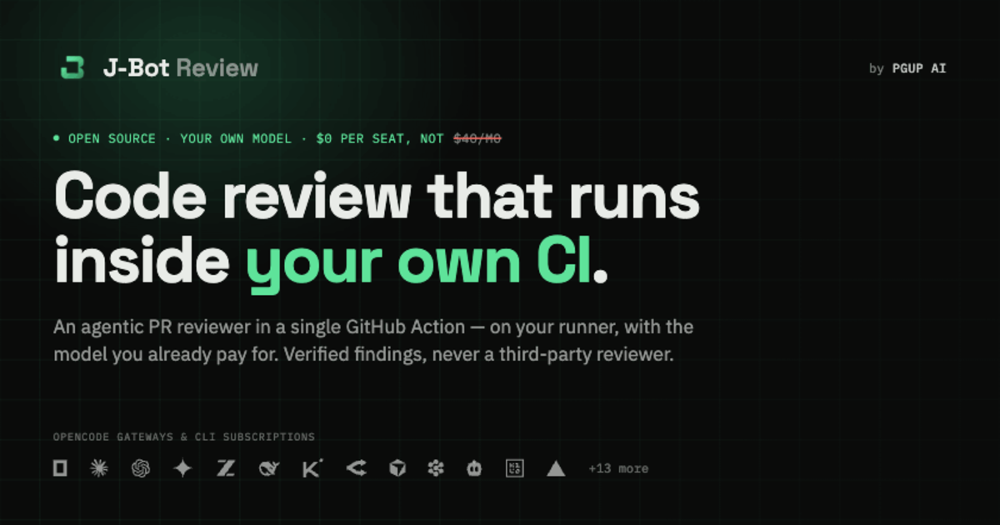

<p align="center">
  
</p>

# J-Bot Code Review

[](https://deepwiki.com/pgup-ai/jbot-review)

J-Bot reviews pull requests on your own GitHub Actions runner. It investigates
repository context, verifies findings, and posts diff-anchored comments. Choose
an OpenCode-backed model or a supported CLI backend, or run the same review
pipeline locally before pushing.

[Quick start](#quick-start) · [Local review](#local-review) ·
[Providers and models](#provider-configuration-in-repo) · [Inputs](#input-reference) ·
[Review controls](#review-quality-controls) · [Project guidelines](#project-guidelines) ·
[Development](#development)

For advanced usage, see [run comparisons](#comparing-review-runs), the
[observer gateway](#observer-gateway), the [ACP gateway](#acp-gateway), or
[self-hosted deployment](deploy/README.md).

## In-repo workflow

Users reference the thin
[`pgup-ai/jbot-review-action`](https://github.com/pgup-ai/jbot-review-action)
repo; this repository builds the Docker image it runs.

### Quick start

**Step 1 — Add a provider secret.** In your repository, open Settings → Secrets
and variables → Actions → New repository secret. Add `OPENCODE_API_KEY` with
your OpenCode API key. This example uses the default OpenCode model; other
providers and their credentials are listed in [Provider configuration](#provider-configuration-in-repo).

**Step 2 — Add `.github/workflows/jbot-review.yml`.**

```yaml
name: J-Bot Code Review
on:
  pull_request:
    types: [opened, reopened, ready_for_review, synchronize, closed]

concurrency:
  group: jbot-review-${{ github.event.pull_request.number }}
  cancel-in-progress: true

permissions:
  contents: read
  packages: read
  pull-requests: write
  issues: write # optional: lets jbot post its review-done 🚀 reaction
  checks: read

jobs:
  review:
    if: github.event.action != 'closed' && github.event.pull_request.draft == false
    runs-on: ubuntu-latest
    steps:
      - uses: actions/checkout@v7
        with:
          fetch-depth: 0
      - uses: pgup-ai/jbot-review-action@v0
        with:
          opencode-api-key: ${{ secrets.OPENCODE_API_KEY }}
          github-token: ${{ secrets.GITHUB_TOKEN }}
```

The `v0` action reference is a moving major-version tag. See
[Image variants](#image-variants) for image choices and revision pinning.
Fork-triggered workflows do not receive provider secrets by default; see
[GitHub's fork PR behavior](https://docs.github.com/en/actions/reference/workflows-and-actions/events-that-trigger-workflows#pull_request).

**Step 3 — Open a non-draft PR.** J-Bot reviews it automatically and runs again
when you push commits. Findings appear as inline comments and a review summary;
see [Review output](#review-output) for verdicts and optional auto-approval.
Merging or closing the PR cancels its queued or running review through the
workflow's concurrency group. Existing installations need the `closed` trigger
and review-job exclusion shown above. Workflows with job-level concurrency also
need a separate close-event job in the same PR group; see
[this repository's workflow](.github/workflows/jbot-review.yml).

Optionally add `AGENTS.md`, `REVIEW.md`, or another supported
[guideline file](#project-guidelines) to customize the review. For external
API and SDK changes, you can also add a
[Context7 key](#context7-documentation-lookup).

### How it works

1. GitHub Actions checks out the repository and starts the review container.
2. J-Bot loads repository guidelines and supplies the selected PR diff to the
   configured backend. Full reviews cover the complete `base...head` diff;
   eligible follow-ups may select affected files, each with its complete PR patch.
3. Main review and enabled auxiliary passes investigate the changes. Findings
   are deduplicated and verified; prior findings are checked for resolution.
4. Code validates diff anchors, applies confidence and severity rules, and posts
   the review. Uncertain candidates remain visible as described under
   [Finding evidence](#finding-evidence) and [review experiments](#review-experiment-preset).

### One-off reviews

The [full workflow example](https://github.com/pgup-ai/jbot-review-action/blob/main/examples/jbot-review.yml)
also supports **one-off reviews**. Comment
`/jbot [--provider=<id>] [--model=<id>] [--auto-approve[=true|false]]` on a PR
(repo owners/members/collaborators only) to re-run the review once with
overrides, e.g. `/jbot --model=devin/glm-5.2 --auto-approve` — the model's
provider segment picks the backend, so `--provider` is only needed for the
legacy pinning behavior.
Bare `--auto-approve` is equivalent to `--auto-approve=true`; explicit `false`
overrides an enabled repository default for that run. Semantics — fallbacks,
fork policy, `workflow_dispatch` parity — are documented in
[`pgup-ai/jbot-review-action`](https://github.com/pgup-ai/jbot-review-action#one-off-reviews-jbot).

### Thread resolution

When jbot verifies a prior finding is fixed, it attempts to post an addressed
reply, then attempts to resolve the GitHub review thread even if posting failed.
Once every finding in a review is represented by a resolved thread, the run that
resolves the final thread (or the next run after a manual resolution) compacts
its stale summary, keeps the original body under a disclosure, and minimizes the
submitted review as resolved.
Some `GITHUB_TOKEN` integrations can post review comments but cannot run
GitHub's `resolveReviewThread` or `minimizeComment` mutation. If you see
`Resource not accessible by integration` in the logs, add a secret such as
`JBOT_REVIEW_THREAD_RESOLUTION_TOKEN` with a PAT or GitHub App token that can
manage PR reviews, then pass it through `thread-resolution-token`.

### Image variants

All variants include the same reviewer code. Review prompts,
model selection and finding policy are identical for supported routes.

| Image tag          | Included local CLIs          | Action entry point                       |
| ------------------ | ---------------------------- | ---------------------------------------- |
| `latest` (default) | All supported CLIs           | `pgup-ai/jbot-review-action@v0`          |
| `latest-slim`      | OpenCode, CommandCode, Devin | `pgup-ai/jbot-review-action/slim@v0`     |
| `latest-opencode`  | OpenCode                     | `pgup-ai/jbot-review-action/opencode@v0` |

Use `:<commit-sha>`, `:<commit-sha>-slim` or `:<commit-sha>-opencode` to pin a
published revision; the `latest` tags track successful builds of main. All
variants are published for Linux amd64. After `npm ci` and `npm run build`, build locally with
`docker build --platform linux/amd64 --target opencode .` (or `--target slim`);
a build without `--target` remains full.

The OpenCode image supports all [J-Bot providers](#provider-configuration-in-repo)
routed through OpenCode, including direct DeepSeek, for both main and auxiliary
models. J-Bot's provider and credential configuration still applies; this does not
expose OpenCode's entire upstream provider catalog. The image excludes other CLI
backends, Poolside and gateway routes. It uses one amd64 baseline binary.

Slim supports its included local runtimes and SDK providers. Cursor, Codex,
Devin and Kilo can also run through a configured ACP gateway with slim.
Unsupported models fail pool validation before selection; no candidates are
silently removed and no CLIs are installed on demand.

Direct Docker/Depot callers can select the image tag. Use the matching action
entry point only after its image and action version are published.

### Review quality controls

Full reviews cover the complete `base...head` diff. Eligible incremental
follow-ups select affected files and review each file's complete PR patch, never
just its latest edit. Repeats of findings covered by unresolved prior jbot threads
are suppressed in code before posting. Several inputs tune the recall/precision/cost
balance:

**Posting behavior.** The first visible run on a PR always posts a review
(baseline), and any run that finds something posts. A clean re-run posts no
comment. With `auto-approve: true`, a clean run approves the exact reviewed
head only when every prior jbot thread is resolved and GitHub reports the PR
open, non-draft, and mergeable. CI, required reviews, and every other merge
requirement remain GitHub's responsibility. Jbot never submits a blocking
`REQUEST_CHANGES` review or calls the review-dismissal API. To keep an older
approval from covering a new head, repositories must require approval of the
most recent reviewable push. That rule does not invalidate an approval when a
same-head re-run finds new or open findings; repositories that need those
findings to block merge must enforce a separate manual or workflow safeguard.
The 🚀 reaction means **the PR has
no open jbot findings** — it is
added only when a real review leaves zero new findings _and_ every prior
finding thread is resolved, and removed when a review starts. So 🚀-present
means "reviewed, all good"; 🚀-absent means a review is in flight or the PR
has open findings. Addressed-thread replies and resolution always run
regardless. A push that leaves the diff byte-identical to the last posted
review, typically an "Update branch" merge from main (see `skip-unchanged`), or
a docs/diagram-only PR under `skip-doc-only: true`, is skipped before any model
call and leaves the reaction unchanged (it isn't reviewed, so it neither earns
nor loses the 🚀). The exception is a merge that changed a rule document the
review loads: that push is reviewed. _Reactions are best-effort: if they don't
appear, grant the workflow `issues: write` (PR reactions use the issues API);
the review itself is unaffected._

| Input                     | Default            | Effect                                                                                                                                                                                                                                                                                                                                                                                                                                                                                                                                                                                                                                                                                           |
| ------------------------- | ------------------ | ------------------------------------------------------------------------------------------------------------------------------------------------------------------------------------------------------------------------------------------------------------------------------------------------------------------------------------------------------------------------------------------------------------------------------------------------------------------------------------------------------------------------------------------------------------------------------------------------------------------------------------------------------------------------------------------------ |
| `auto-approve`            | `false`            | Approve the exact reviewed head when the run produces no findings before display filters, all prior jbot threads are resolved, and GitHub reports the PR open, non-draft, and mergeable. Existing same-head jbot approvals are not duplicated. GitHub branch protection still decides whether the PR can merge.                                                                                                                                                                                                                                                                                                                                                                                  |
| `review-passes`           | `1`                | Total review passes (1–3). Passes beyond the first add focused recall lenses (cross-hunk interactions, then security/data-integrity) in parallel on the aux model; findings merge and dedupe. Raise to 2-3 for maximum recall.                                                                                                                                                                                                                                                                                                                                                                                                                                                                   |
| `dynamic-fanout`          | `true`             | Scale the recall-supplement fan-out (extra lens passes + the guideline-compliance pass) to the diff's risk and size: a small, low-risk change (≤3 files, ≤60 added lines, no security/data/API/infra path or build/CI tooling like `package.json`/`action.yml`/workflows, no dependency-manifest change, no large deletion) runs the general pass only and skips the guideline pass; everything else runs the full requested fan-out. The requested config is the ceiling — this only ever reduces it, and never gates the main review or `verify-findings`. Set `false` to force the full requested fan-out on every PR.                                                                        |
| `verify-findings`         | `true`             | All findings, including P3 and nits, are adversarially re-checked before posting, with blocking findings first. Refuted findings are dropped; uncertain candidates remain in diagnostics and are withheld from PR comments, except as described under [Finding evidence](#finding-evidence).                                                                                                                                                                                                                                                                                                                                                                                                     |
| `review-shards`           | `1`                | Initial file groups: `1`, `0` for automatic grouping, or `N`. Oversized groups and files are automatically paged against the full prompt budget. Every page must complete; additional pages wait under the session concurrency limit.                                                                                                                                                                                                                                                                                                                                                                                                                                                            |
| `time-budget-minutes`     | `30`               | Wall-clock target (`0` = no budget). See [review scheduling](#review-scheduling) for finder deadlines, verification reserves and incomplete coverage.                                                                                                                                                                                                                                                                                                                                                                                                                                                                                                                                            |
| `max-concurrent-sessions` | `3`                | Maximum simultaneous model sessions. `0` also selects the bounded default of `3`; set a positive limit appropriate for your provider tier.                                                                                                                                                                                                                                                                                                                                                                                                                                                                                                                                                       |
| `model-options`           | provider-dependent | JSON provider options for the main model. Defaults to `{"reasoningEffort":"low"}` (`high` for space-bunny, which barely reasons at low); Poolside uses `{"reasoningEffort":"default"}`, and custom endpoints without a model catalog use `{}`. Explicit options override the default, subject to model-supported effort tiers. A distinct auxiliary model gets its own default; auxiliary sessions using the main model share its options. Verification defaults to low and reduces higher main efforts by one tier. CommandCode maps effort to supported CLI tiers; unknown models keep the CLI default. Other CLI backends do not consume these options; Devin encodes effort in its model ID. |
| `prompt-cache`            | `true`             | Enable opencode prompt caching (provider `setCacheKey`). Parallel shards and re-reviews of the same PR share a byte-identical prompt prefix, so caching cuts input-token cost on models that honor it; models marked unsupported by capability metadata omit the cache key entirely. Each session logs a `tokens: …` line with `cache(read=… write=…)` — `read > 0` on a later shard or re-review confirms a hit. Mostly matters on paid tiers.                                                                                                                                                                                                                                                  |
| `skip-doc-only`           | `false`            | Set `true` to skip the full review (no model call) when the entire PR diff is documentation, prose, or diagram assets (`.md`, `.mdx`, `.markdown`, `.rst`, `.adoc`, `.txt`, `.pdf`, `.svg`, `.drawio`, `.dio`, `.excalidraw`, `.mmd`, `.puml`, `.plantuml`); the reaction is left unchanged (a docs push doesn't change the verdict). Evaluated on the **reviewable** file set (noise like lockfiles and patchless/binary files are excluded — the bot never reviews those anyway, so the skip never drops review coverage); any reviewable code/config file forces a full review. Off by default: review rules live in docs, so docs changes get reviewed.                                      |
| `skip-unchanged`          | `true`             | Skip the full review (no model call) when the merge-base-relative patch set is byte-identical to the one the last posted jbot review covered — the common "Update branch" merge from main, unless that merge changed a rule document the review loads. Anything uncertain (no completion footer on the latest review, incomplete coverage, compare failure or its 300-file cap, binary/patchless files) fails open to a full review, and comment-triggered, manually dispatched, or `auto-approve` runs always review (approval must re-attest the newest head). Set `false` to review every push.                                                                                               |
| `review-telemetry`        | `true`             | Write per-finding disposition + per-session token telemetry to the gitignored `.jbot-review/telemetry.jsonl` (uploaded as a CI artifact by the dogfood workflow). Near-zero overhead; `false` disables.                                                                                                                                                                                                                                                                                                                                                                                                                                                                                          |
| `evidence-quotes`         | `true`             | Ask each finding for a verbatim quote of the changed line it flags. Grounds finding verification and lets a finding whose line anchor missed the diff be re-anchored to its quoted line instead of dropped. `false` restores the pre-evidence prompt byte-for-byte.                                                                                                                                                                                                                                                                                                                                                                                                                              |

Follow-up reviews automatically select affected files when a completed baseline
and the impact checks allow it. No new input or environment variable is needed.
The first review and uncertain follow-ups use full review. Dynamic fan-out is
already enabled by default. An explicit review request or the existing
`skip-unchanged: false` setting forces full review.

A follow-up can reuse the latest posted review that completed a baseline when
its model, guidelines and review settings still match. PR title and
description edits don't count. A moved base counts only until the PR merges
it: the follow-up then selects the PR files the author or the merged commits
edited, plus PR files importing a module the merge changed. A rebase rewrites
history and falls back to full review. A model pool counts
as one setting, so the member a push draws does not force full review, and a
later review that left a finding unverified keeps the earlier baseline. The
first version handles small modifications to existing JavaScript/TypeScript
files. It expands the selected files through declarations, references and their
directories, delivering each selected file's **complete PR patch**, not only its
latest edit. It falls back to full review for uncertain history or dependencies,
references outside the PR, contract changes, default-export modules, unresolved
relative imports, broad changes, open findings on files the follow-up edits,
tool-less reviewers, explicit reruns and auto-approval. Verification stays
enabled according to its existing setting. Reports identify incremental reviews;
telemetry records the baseline, selected/total files and fallback reason. Quiet
clean runs keep the last posted baseline, so their changes remain included in
the next follow-up.

This is conservative impact detection, not proof that every possible runtime
relationship is known. Keep full review for final approval. Compare locally with
`node --env-file=.env --import tsx scripts/incremental-review-compare.ts`; it runs
paired full/incremental reviews with OpenCode's free MiMo Flash model, without
posting to GitHub.
See the [comparison results and limitations](docs/audits/incremental-followup-review.md).

CommandCode's space-bunny defaults to `medium` instead of `high` on diffs over
20 KB, where `high` ran past the finder cap. An explicit `model-options` still wins.

CommandCode MiMo v2.6 Flash, Pro and Pro UltraSpeed have no adjustable reasoning
effort in CLI 1.62.0 through 1.69.0. J-Bot omits `--effort` and logs `effort=not-configurable`;
the global low default does not control these models. Other models without a
mapped effort log `effort=cli-default`.
Xiaomi's [Responses API documentation](https://mimo.mi.com/docs/en-US/api/chat/responses)
accepts effort labels but says all non-`none` levels enable thinking with the same
behavior; setting `low` there does not select a lower reasoning budget.

Incomplete auxiliary passes are named in the review report, including reruns with
no findings. These runs retain findings from completed passes but do not receive
an automatic approval or review-done reaction. CommandCode cancellation stops its
process tree and waits for output pipes to close before removing its temporary home.
Queued passes cancelled before execution never start a provider session.
Tool-capable OpenCode verifiers can read and search repository evidence;
CommandCode verifiers can investigate when `JBOT_COMMANDCODE_TOOLS=true`.
Changes-since summaries receive up to 256 KiB
of delta diff plus a bounded file overview; larger deltas disclose summary-only
omissions. Main reviews retain complete PR patches for their selected files.

**Prompt/context arms (env, not inputs).** `JBOT_EMBEDDED_FIRST_PROMPT` (on),
`JBOT_CONTEXT_TRIM` (off), `JBOT_SHARED_PREFIX_PROMPT` (off) and
`JBOT_RULES_ONLY_TESTS` (on) are set by environment rather than action input;
the [local review](#local-review) knob list describes what each changes. Map
them onto the `uses:` step to switch one from a repo variable without editing a
file:

```yaml
env:
  JBOT_CONTEXT_TRIM: ${{ vars.JBOT_CONTEXT_TRIM }}
  JBOT_EMBEDDED_FIRST_PROMPT: ${{ vars.JBOT_EMBEDDED_FIRST_PROMPT }}
  JBOT_SHARED_PREFIX_PROMPT: ${{ vars.JBOT_SHARED_PREFIX_PROMPT }}
  JBOT_RULES_ONLY_TESTS: ${{ vars.JBOT_RULES_ONLY_TESTS }}
```

Only the literal `true`/`false` count; anything else, including an unset
variable, takes the default above.

**Heavy-model recipe:** select one heavy model when every main review should
use it. Main and auxiliary roles draw independently from a pool; list order
does not assign roles. For a provider tier that supports concurrent sessions:

```yaml
model: ${{ vars.JBOT_REVIEW_MODEL }}
review-shards: '0'
max-concurrent-sessions: '6'
```

Reasoning effort defaults to `low` for most models, with the provider-specific
exceptions listed above. Set `model-options` explicitly when you need a higher
supported effort.

`review-shards` controls initial grouping. Complete diff pages are then fitted
to the assembled prompt budget, so even `1` can produce several sessions.
A main page that still fails after its retry aborts the run before posting
partial coverage; auxiliary sessions fail open and report their incomplete
coverage. On free/throttled tiers, leave the initial grouping at `1` and keep
session concurrency within the provider's limits.

### Provider configuration (in-repo)

See the generated [model ID catalog](./MODEL_CATALOG.md) for every current
Models.dev ID and the model IDs exposed by each supported CLI. Refresh it with
`npm run models:update`; account-scoped CLI sections require those CLIs to be
authenticated locally. The generator uses the npm versions pinned in the
Docker image; Cursor comes from its vendor-installed binary, while Devin has no
enumerable catalog command and is documented as that explicit boundary.

| `provider`              | Default model                                                   | Action key input                | Secret/env var                       |
| ----------------------- | --------------------------------------------------------------- | ------------------------------- | ------------------------------------ |
| `opencode`              | `opencode/deepseek-v4-flash`                                    | `opencode-api-key`              | `OPENCODE_API_KEY`                   |
| `opencode-go`           | `opencode-go/deepseek-v4-flash`                                 | `opencode-api-key`              | `OPENCODE_API_KEY`                   |
| `deepseek`              | `deepseek/deepseek-v4-flash`                                    | `deepseek-api-key`              | `DEEPSEEK_API_KEY`                   |
| `openai`                | `openai/gpt-5.4-nano`                                           | `openai-api-key`                | `OPENAI_API_KEY`                     |
| `openai-compatible`     | required                                                        | `openai-compatible-api-key`     | `JBOT_OPENAI_COMPATIBLE_API_KEY`     |
| `anthropic`             | `anthropic/claude-sonnet-4-6`                                   | `anthropic-api-key`             | `ANTHROPIC_API_KEY`                  |
| `google`                | `google/gemini-2.5-flash`                                       | `gemini-api-key`                | `GEMINI_API_KEY`                     |
| `openrouter`            | `openrouter/openai/gpt-4o-mini`                                 | `openrouter-api-key`            | `OPENROUTER_API_KEY`                 |
| `nvidia`                | `nvidia/nemotron-3-ultra-550b-a55b`                             | `nvidia-api-key`                | `NVIDIA_API_KEY`                     |
| `zai-coding-plan`       | `zai-coding-plan/glm-5.2`                                       | `zai-api-key`                   | `ZAI_API_KEY`                        |
| `kimi-code-plan-global` | `kimi-code-plan-global/k3`                                      | `kimi-api-key`                  | `KIMI_API_KEY`                       |
| `kimi-code-plan-cn`     | `kimi-code-plan-cn/k3`                                          | `kimi-api-key`                  | `KIMI_API_KEY`                       |
| `xai`                   | `xai/grok-4.3`                                                  | `xai-api-key`                   | `XAI_API_KEY`                        |
| `fireworks-ai`          | `fireworks-ai/accounts/fireworks/models/deepseek-v4-flash-0731` | `fireworks-api-key`             | `FIREWORKS_API_KEY`                  |
| `xiaomi-token-plan-sgp` | `xiaomi-token-plan-sgp/mimo-v2.5-pro`                           | `mimo-api-key`                  | `MIMO_API_KEY`                       |
| `tokenrouter`           | `tokenrouter/z-ai/glm-5.3-free`                                 | `tokenrouter-api-key`           | `TOKENROUTER_API_KEY`                |
| `devin`                 | `devin/default`                                                 | `devin-windsurf-api-key`        | `DEVIN_WINDSURF_API_KEY`             |
| `commandcode`           | `commandcode/default`                                           | `commandcode-access-key`        | `COMMANDCODE_ACCESS_KEY`             |
| `cursor`                | `cursor/default`                                                | `cursor-api-key`                | `CURSOR_API_KEY`                     |
| `poolside`              | `poolside/laguna-s-2.1`                                         | `poolside-api-key`              | `POOLSIDE_API_KEY`                   |
| `qoder`                 | `qoder/auto`                                                    | `qoder-token`                   | `QODER_PERSONAL_ACCESS_TOKEN`        |
| `codex`                 | `codex/default`                                                 | `codex-auth`                    | `CODEX_AUTH_JSON`                    |
| `cline`                 | `cline/default`                                                 | `cline-auth`                    | `CLINE_AUTH_JSON`                    |
| `cline-pass`            | `cline-pass/default`                                            | `cline-auth`                    | `CLINE_AUTH_JSON`                    |
| `grok`                  | `grok/default`                                                  | `grok-auth`, then `xai-api-key` | `GROK_AUTH_JSON`, then `XAI_API_KEY` |
| `kilo`                  | `kilo/kilo-auto/free`                                           | `kilo-auth`                     | `KILO_AUTH_CONTENT`                  |
| `dim`                   | `dim/dimcode-api-oauth/deepseek-v4-flash`                       | `dim-auth`                      | `DIM_AUTH_BUNDLE`                    |

#### Credentials and backend behavior

Pass the credential for each provider in your model pool. Empty key inputs are
ignored; each provider reads its configured credential input. For a
single-provider setup, pass only that provider's key.

To override TokenRouter's default endpoint, set `JBOT_TOKENROUTER_BASE_URL` in
the action step's `env` block. The public `@v0` actions do not expose a
`tokenrouter-base-url` input.

`opencode-go` uses the same `OPENCODE_API_KEY` as `opencode`; comma-separate
several of them and each run picks, among accounts whose 5h and weekly Go-plan
windows are still open, the one with the most monthly allowance left. Unlike CommandCode a
spent plan is not fatal on its own: accounts that bill overage to the credit
balance keep serving and are preferred, while one with overage blocked is
picked only when nothing else is left, and its requests can still fail. Ranking
needs keys with the console's `all` permission — an inference-only key cannot
read plan meters, and its probe degrades to "usage unavailable" rather than
failing.

**CLI-backend credentials.** Use the file, key, or bundle listed for your backend:

| Backend          | Get the credential                                                                                                                                                                                                | Secret (Action input)                                            |
| ---------------- | ----------------------------------------------------------------------------------------------------------------------------------------------------------------------------------------------------------------- | ---------------------------------------------------------------- |
| **Codex CLI**    | `codex login` (ChatGPT Plus/Pro) → paste the whole `~/.codex/auth.json`                                                                                                                                           | `CODEX_AUTH_JSON` (`codex-auth`)                                 |
| **Cline**        | `cline auth` → paste the whole `~/.cline/data/settings/providers.json`                                                                                                                                            | `CLINE_AUTH_JSON` (`cline-auth`)                                 |
| **Grok Build**   | `grok login --device-auth` → paste `~/.grok/auth.json`; alternatively create an xAI API key                                                                                                                       | `GROK_AUTH_JSON` (`grok-auth`), or `XAI_API_KEY` (`xai-api-key`) |
| **Cursor**       | Create a key at [cursor.com/dashboard/integrations](https://cursor.com/dashboard/integrations) → paste it (`crsr_…`)                                                                                              | `CURSOR_API_KEY` (`cursor-api-key`)                              |
| **Qoder CLI**    | Create a Personal Access Token under [Qoder Integrations](https://qoder.com/account/integrations)                                                                                                                 | `QODER_PERSONAL_ACCESS_TOKEN` (`qoder-token`)                    |
| **Devin**        | `devin auth login` → copy `windsurf_api_key` (`devin-session-token$…`) from `~/.local/share/devin/credentials.toml` ([docs](https://docs.devin.ai/cli))                                                           | `DEVIN_WINDSURF_API_KEY` (`devin-windsurf-api-key`)              |
| **Command Code** | Create an access key at [commandcode.ai](https://commandcode.ai/docs/quickstart) (`user_…`; the `apiKey` in `~/.commandcode/auth.json`) → paste it; comma-separate multiple keys for a balance-aware per-run pick | `COMMANDCODE_ACCESS_KEY` (`commandcode-access-key`)              |
| **Kilo**         | `kilo auth login` → paste the whole `~/.local/share/kilo/auth.json`                                                                                                                                               | `KILO_AUTH_CONTENT` (`kilo-auth`)                                |
| **DimAgent**     | Run `npm run dim:bundle` from an authenticated local setup and copy the emitted bundle                                                                                                                            | `DIM_AUTH_BUNDLE` (`dim-auth`)                                   |

Each CLI backend runs **read-only** (Cline by plan mode alone, below) and only
when the main or aux model names it. Cline and Command Code write their credential into an
isolated temporary `HOME`, Codex into a temporary `CODEX_HOME`, and Qoder carries
its PAT through a one-time SDK auth payload while using a temporary `HOME`; each is
removed after the run. Cursor reads its key straight from the env (no file); Devin writes
`~/.local/share/devin/credentials.toml` under a separate temporary `HOME` per CLI
invocation, removed after its process exits. Cline runs in the checkout in plan
mode with every tool auto-approved, so it can read the code. Cline approves tools
all at once, so its shell and write tools are approved too, and hooks and rules
the checkout commits (`.cline/hooks`, `.clinerules`) load: an accepted risk on
CI runners. It uses only the auth token — the file's `model`/`reasoning` are
stripped — and has two billing
modes sharing one secret: `cline` (pay-as-you-go) and `cline-pass` (Cline
subscription). Kilo reads its credential from the `KILO_AUTH_CONTENT` env var (no
file written) with an isolated temporary `HOME`/`XDG_DATA_HOME` per session,
removed after the run; it defaults to the free `kilo/kilo-auto/free` gateway
model.

Set `JBOT_CLINE_SDK_VERIFIER=true` to verify findings on a Cline aux route
through the [Cline SDK](https://docs.cline.bot/sdk/clinecore) (full image only).
A child process with the CLI's environment and temporary `HOME` runs the SDK's
bare agent, never its harness, which runs a checkout's `.cline` hooks and loads
its `.clinerules`. Its only tools are J-Bot's: read, grep, and list tracked
files inside the checkout, never `.git`. It identifies as the SDK
(`X-CLIENT-TYPE: cline-sdk`); a 403 leaves the findings unverified, and any
other failure falls back to the CLI's single pass.

Poolside uses its OpenAI-compatible chat-completions endpoint directly. Laguna
S 2.1 is absent from Poolside's advertised model list, but the endpoint accepts
`poolside/laguna-s-2.1` explicitly, so J-Bot uses it by default. Requests stream
directly, use Poolside's full 32,768-token completion allowance, and leave
reasoning at Poolside's default unless `model-options.reasoningEffort` overrides
it. This avoids the Pool CLI's coding-agent loop while preserving review,
auxiliary, token usage, timeouts, and repair behavior.

Qoder can read and search the checkout but receives no shell or write-capable tool.
Its user/project settings, hooks, MCP servers, skills, memory, web access, and
subagents are disabled. Every assigned diff hunk is embedded in budgeted pages;
content that cannot fit fails explicitly instead of being silently omitted.
Auxiliary sessions fail open as usual.

`grok` is an opt-in Grok Build CLI backend and is intentionally separate from
`xai`: existing `provider: xai` configurations continue using `XAI_API_KEY`
through the SDK engine unchanged. For `provider: grok`, account auth is preferred
when both credentials are configured; the API key is passed only when account
auth is absent, so an expired login cannot silently switch to paid API usage.
Grok Build runs headlessly with edits, shell,
MCP, web access, memory, and subagents disabled. It receives the budgeted review
prompt in an empty read-only temporary workspace, so repository Grok config,
plugins, and hooks cannot execute. Each review page includes its complete
assigned diff, preserving review coverage without checkout access.
Sessions are serialized through one per-run temporary Grok home, removed after
the run. With account auth, this lets credential rotations persist without
concurrent writes. Whether a rotated refresh token from one ephemeral
GitHub-hosted run can be reused from the original `GROK_AUTH_JSON` secret on the
next run is not yet a documented xAI contract. Treat repeated hosted-run auth as
unresolved during dogfood; jbot-review never logs or exports the rotated
credential.
The CLI account's availability, quota, and acceptable-use terms remain controlled
by xAI; dogfood with `provider: grok`, `model: grok/default`, and conservative
concurrency before wider use.

#### Backend execution and limits

**SDK engines.** Non-CLI providers other than Poolside run on the opencode
server. The in-process pi SDK engine was removed: `sdk-engine: auto` (or
`JBOT_SDK_ENGINE=auto`) now logs that and uses opencode. The provider catalog
supplies each model's context window. Repository investigation has no
tool-call, total-output, distinct-file, repeat-read, or dependency-depth quota;
existing session deadlines and per-command process limits still apply.

**CLI and ACP routing.** Without `JBOT_ACP_GATEWAY_URL`, `devin` runs through
its headless CLI from an isolated temporary workspace, with repository-controlled
Devin configuration excluded and a per-session permission config that denies
edit and write operations.
Setting that URL routes gateway-supported providers (`devin`, `cursor`,
`codex`, `kilo`) to a remote companion over the
[Agent Client Protocol](https://agentclientprotocol.com); the gateway token and
endpoint are then required. Remote read-only enforcement combines the ACP
permission policy with each agent's read-only configuration.
`cline` stays on its argv driver.
Every main task now receives all assigned diff hunks directly, on every backend.
Related files stay grouped where they fit. Oversized groups split into pages;
oversized files split at hunks, and a single large hunk splits at line boundaries
with preserved coordinates. The original hunk body must reconstruct exactly.
Even `review-shards: 1` can produce multiple pages. A single line or fixed prompt
that cannot fit fails explicitly instead of truncating mandatory content.

The planner measures instructions, guidelines, shared context, diff and evidence
together. It checks transport bytes separately from a conservative UTF-8-byte
bound on text tokens, reserving output and harness headroom (including backend
tool directives). PR metadata and prior-review context shrink with an omission
notice when needed to preserve room for the mandatory diff. Known SDK models use
the installed offline catalog limits; Cline's free Muse, DeepSeek v4.1 Flash,
Gemini 3.8 Flash, MiMo v2.6 Flash and Space Bunny use limits from the pinned CLI
catalog. Paid Muse Contributor and DeepSeek v4/v4.1 Flash use verified
live-catalog limits. Unknown CLI models log an
unknown model limit and use a conservative 128,000-token policy ceiling. This is not an exact
provider tokenizer or a guarantee about a CLI's hidden prompt. Cline still has
a final 120 KiB argv check, with 2 KiB reserved for its wrapper. No task contains
more than 120 KiB of input text.

All pages use the shared concurrency queue. Lens and guideline checks are paged
too; oversized verification batches shrink and receive relevant diff pages plus
cited source. Optional checks fail open with incomplete coverage. Logs and
telemetry count expected/delivered hunks and expected/completed/incomplete tasks;
file counts distinguish whole files from files continued on other pages. A
hunk counts as delivered only when every part completes. Partial main results
fail the run. These counts establish delivery, not model comprehension. Shared maps and bounded caller/contract
excerpts support cross-file checks; they cannot prove exhaustive dependency
coverage. The opencode server engine keeps serving SDK providers directly — its ACP mode
would drop per-session token usage, provider model listing, and Context7 MCP.

Review metadata reports backend usage counters when they are available.
OpenCode-backed and Qoder sessions report token counters and cost from result
metadata. The ACP-driven backends (cursor/devin/codex) and the other CLI
backends do not report machine-readable per-session usage today, so those
sessions may be absent from the metadata block.
These counters are observability only: they do not identify API keys,
accounts, organizations, quota buckets, remaining quota, or reset times, so
jbot-review does not use them for smart key rotation.

CommandCode checks monthly plan credits and five-hour/weekly limits before selecting a key. Exhausted keys are excluded even when purchased credits remain. If no key has confirmed available limits, the run stops before launching review sessions; this includes when all usage probes fail. A key can still reach its limit after selection if other runs consume the same allowance.

Use `provider: zai-coding-plan` with `zai-api-key` / `ZAI_API_KEY` for the
Z.AI GLM Coding Plan subscription endpoint.
Use `provider: kimi-code-plan-global` (kimi.ai) or `kimi-code-plan-cn`
(kimi.com) with `kimi-api-key` / `KIMI_API_KEY` for the native Models.dev Kimi
Coding Plan providers; pick the domain that issued the key. Their current
default is Kimi K3.

```yaml
provider: kimi-code-plan-global
kimi-api-key: ${{ secrets.KIMI_API_KEY }}
```

For an arbitrary OpenAI-compatible endpoint, set all three explicit values:

```yaml
provider: openai-compatible
model: openai-compatible/my-served-model
openai-compatible-api-key: ${{ secrets.JBOT_OPENAI_COMPATIBLE_API_KEY }}
openai-compatible-base-url: ${{ vars.JBOT_OPENAI_COMPATIBLE_BASE_URL }}
```

These namespaced settings never fall back to `OPENAI_API_KEY` or
`OPENAI_BASE_URL`, so the direct `openai` provider remains isolated. The model
is required because a generic endpoint has no safe provider-wide default.
For local review or the webhook app, the equivalent environment is:

```dotenv
MODEL=openai-compatible/my-served-model
JBOT_OPENAI_COMPATIBLE_API_KEY=sk-example
JBOT_OPENAI_COMPATIBLE_BASE_URL=https://proxy.example/v1
```

J-Bot omits its `setCacheKey` option for both Kimi providers and
`openai-compatible`: the live catalog does not advertise it for Kimi, and a
generic endpoint may reject the extra request field.

Use `provider: google` with `gemini-api-key` / `GEMINI_API_KEY` for direct
Gemini API key auth.
Use `provider: devin` with `devin-windsurf-api-key` /
`DEVIN_WINDSURF_API_KEY` for the Devin CLI backend. The Docker image includes
the Devin CLI, but credentials are written only when the main or active
auxiliary provider is `devin`.
J-Bot resolves `devin/swe-2` and `devin/swe` to `devin/swe-2-medium`.
Use `devin/swe-2-high` or `devin/swe-2-max` to select those reasoning levels explicitly.
Devin shares the global `max-concurrent-sessions` limit
(`JBOT_MAX_CONCURRENT_SESSIONS`, default 3), with no separate provider cap.
Each review pass has its own CLI state: a turn that ends on a plan instead of
the review is nudged to continue in that same session by a Stop hook, and JSON
repair resumes it with `-c`. Abandoned sessions are cancelled before their
temporary files are removed.
Use `provider: commandcode` with `commandcode-access-key` /
`COMMANDCODE_ACCESS_KEY` for the CommandCode CLI backend. The Docker image
includes the CommandCode CLI, but `.commandcode/auth.json` is written under an
isolated temporary HOME only when the main or active auxiliary provider is
`commandcode`, then removed after the run. Sessions start in an empty directory;
repository and operator settings, hooks, mods, and skills are excluded.

CommandCode uses its native CLI tools in plan mode by default. The isolated
settings grant repository access through `permissions.additionalDirectories`;
`--add-dir` alone does not grant access in the pinned headless CLI. Set
`JBOT_COMMANDCODE_TOOLS=false` to use embedded evidence only. Local arena and
benchmark runs use the `reviewConfig.commandCodeTools` manifest value.
J-Bot loads no custom tool mod and continues embedding the complete assigned diff.
Native tools own search syntax, read limits and continuation behavior; J-Bot
records their completion/error counts and session token usage. JSON repairs use a
fresh temporary home with tools denied, leaving other sessions unaffected.

OpenCode verification reserves time for one recovery attempt using its current
model, settings and native read-only agent. Recovery forks the collected history
and asks for only the missing checks needed to finish verdicts. Completed verdicts
are preserved; insufficient evidence remains uncertain. It runs after a timeout
or incomplete output within the existing budget. Recovery reserves part of the
time left after setup (about a minute from five minutes); unbounded runs skip
recovery. Logs report the model, reason, time used and verdict count. No separate model flag or paid fallback is needed.
JSON repair and formatting remain tool-less.

CommandCode verification receives packed source evidence from earlier native
review reads by default. Only successfully observed, tracked source is eligible;
files are revalidated before reuse, and lines already in cited-source context
are removed. The packet is capped at 6 KB and omitted if the assembled prompt
would exceed its budget. Verifiers can still use native tools. This handoff stays
within one review run; it does not cache verdicts or enable Jev.
Missing or unsupported journals fall back to the existing verification context.
Set `JBOT_PACKED_HANDOFF=false` to disable it. Other harnesses are unchanged.
Run logs report observed files, unsupported reads, duplicate lines, stale files,
selected/omitted excerpts, preparation time and injected bytes.

Use `provider: cursor` with `cursor-api-key` / `CURSOR_API_KEY` for the Cursor
CLI backend. The Docker image includes the Cursor CLI (`cursor-agent`), which
reads the key from the environment — no credential file — and runs read-only via
`--mode plan`.
Use `provider: poolside` with `poolside-api-key` / `POOLSIDE_API_KEY` for the
Poolside inference provider. Its default is `poolside/laguna-s-2.1`.
Use `provider: qoder` with `qoder-token` /
`QODER_PERSONAL_ACCESS_TOKEN` for the Qoder CLI backend. It accepts `auto`,
`ultimate`, `performance`, `efficient`, and `lite` model tiers. Each session uses
an isolated temporary home and the Agent SDK's streaming protocol; project/user
settings, hooks, MCP, writes, shell, web access, and subagents are disabled.

#### Changing models

Use a fully qualified `provider/model` reference. To change models without
editing the workflow, define the Actions variable `JBOT_REVIEW_MODEL` and pass
it as `model`. For example, a pool using OpenCode and OpenRouter needs both keys:

```yaml
- uses: pgup-ai/jbot-review-action@v0
  with:
    model: ${{ vars.JBOT_REVIEW_MODEL || 'opencode/deepseek-v4-flash' }}
    opencode-api-key: ${{ secrets.OPENCODE_API_KEY }}
    openrouter-api-key: ${{ secrets.OPENROUTER_API_KEY }}
    github-token: ${{ secrets.GITHUB_TOKEN }}
```

Pass the matching credential whenever you add a provider to the pool. For
`openai-compatible`, also pass its namespaced base URL. Local review and the
webhook app use `MODEL` and the environment variables in the provider table.

#### Model references select the provider

A model is written `<provider>/<model id>`, and that first segment is what picks
the provider, its credential, and its base URL — so `provider` is no longer
needed:

```yaml
model: opencode/deepseek-v4-flash
```

Only the **first** slash splits. Everything after it is the provider's own model
id and may contain further slashes, so `kilo/zai/glm-5.2` and `devin/glm-5.2`
are two distinct routes to what may be the same underlying model, and NVIDIA's
publisher-prefixed ids stay intact as `nvidia/moonshotai/kimi-k2.6`. A model id
with no provider segment falls back to `opencode`.

A comma-separated `model` is a pool. A workflow run's first attempt chooses one
candidate by hashing the PR head sha; each rerun attempt advances to the next
candidate and wraps at the end. New runs for the same head start from the
same candidate, so the initial choice stays reproducible while reruns can bypass
a failing model. Every candidate is validated before the review starts, so a
typo fails the next run outright rather than only the runs that happen to pick
it. The chosen model is logged and appears in the posted review's metadata block.

**Candidates may name different providers.** Main and auxiliary roles can
select different providers in the same run. Each provider's key is resolved
separately, so a pool can mix them:

```yaml
model: opencode/deepseek-v4-flash,deepseek/deepseek-v4-flash,openai/gpt-5.4-nano
```

Every provider a pool draws on needs its own key, and all of them are resolved
before the review starts — a missing one fails the next run outright rather
than only the runs that happen to pick that provider. Listing a model is a
request to review with it, so an unusable candidate is a configuration error,
never silently skipped.

**Auxiliary sessions draw from the same pool.** Their seed is salted, so the two
picks are independent rather than locked to the same index — not that they
differ. Both hash into the same pool, so roughly 1/n of runs land both roles on
one candidate (half the runs on a two-model pool), and a one-entry pool
always does. That is when the aux session shares the main model's options entry
and its effort instead of the lower aux default. Neither draw prefers a
position, so pool order carries no heavy/fast role assignment. A rerun advances
both draws, so it also moves the auxiliary sessions to another candidate.

**Legacy `provider`** still works unchanged. Setting it _pins_ the provider: an
unprefixed id belongs to it, a matching `provider/` prefix is stripped, and any
other slash prefix stays part of the model id (`provider: nvidia` + `model:
moonshotai/kimi-k2.6` → `nvidia/moonshotai/kimi-k2.6`).

Set it only to keep an existing configuration working; new setups should qualify
every candidate and drop the input. Dropping `provider` while a model id is still
unqualified falls back to `opencode`.

`aux-model` and `aux-provider` were removed; either one still being set is
ignored with a warning.

For manual reruns, `workflow_dispatch` provider and model inputs can take
precedence over `JBOT_REVIEW_PROVIDER` and `JBOT_REVIEW_MODEL`; automatic
`pull_request` runs use the variable values.

### Context7 documentation lookup

Set `enable-context7: auto` and pass `context7-api-key` from
`secrets.CONTEXT7_API_KEY` to let the review agent verify current docs when the
PR changes external API, SDK, framework, CLI, cloud-service, or GitHub Actions
usage. In `auto` mode, Context7 is skipped for ordinary business-logic changes.
Reviews are told not to search the web or download packages to check library
behavior, and OpenCode sessions have no web or code-execution tools, so without
Context7 an unconfirmed library claim stays advisory. Use `enable-context7: true` when the
code reaches a library through in-house wrappers that `auto` does not detect.

Context7 failures are non-blocking: if the MCP server cannot connect, rejects
auth, or rate-limits, the action logs a warning and continues the review without
documentation lookup.

### Input reference

The table below covers setup and posting inputs. See
[Review quality controls](#review-quality-controls) for tuning inputs and
[`action.yml`](action.yml) for the complete action contract.

**Migrating from `api-key`:** replace the old unified `api-key` input with the
matching provider-specific input, such as `opencode-api-key` for
`provider: opencode`. The unified input is not read by current `v0` builds.

| Input                        | Required | Default               | Description                                                                                                                                                                                                                                                  |
| ---------------------------- | -------- | --------------------- | ------------------------------------------------------------------------------------------------------------------------------------------------------------------------------------------------------------------------------------------------------------ |
| `provider`                   | No       | from `model`          | Deprecated — qualify `model` instead; pins the provider when set (`JBOT_REVIEW_PROVIDER`)                                                                                                                                                                    |
| `model`                      | No       | `opencode` default    | `provider/model` reference, or a comma-separated pool that may span providers; required for `openai-compatible`; can come from `JBOT_REVIEW_MODEL`                                                                                                           |
| `sdk-engine`                 | No       | `opencode`            | Only `opencode` remains; `auto` (the removed pi engine) logs and uses opencode                                                                                                                                                                               |
| `opencode-proxy-url`         | No       | —                     | Optional HTTP/HTTPS proxy URL for OpenCode; successful verification pins SDK sessions to OpenCode; ignored for fork-head PRs and skipped without failing the review when unavailable                                                                         |
| `opencode-api-key`           | No       | —                     | Used when the main or aux model names `opencode`/`opencode-go`                                                                                                                                                                                               |
| `deepseek-api-key`           | No       | —                     | Used when the main or aux model names `deepseek`                                                                                                                                                                                                             |
| `openai-api-key`             | No       | —                     | Used when the main or aux model names `openai`                                                                                                                                                                                                               |
| `openai-compatible-api-key`  | No       | —                     | Namespaced key for `openai-compatible`                                                                                                                                                                                                                       |
| `openai-compatible-base-url` | No       | —                     | Required endpoint URL for `openai-compatible`                                                                                                                                                                                                                |
| `anthropic-api-key`          | No       | —                     | Used when the main or aux model names `anthropic`                                                                                                                                                                                                            |
| `gemini-api-key`             | No       | —                     | Used when the main or aux model names `google`                                                                                                                                                                                                               |
| `openrouter-api-key`         | No       | —                     | Used when the main or aux model names `openrouter`                                                                                                                                                                                                           |
| `nvidia-api-key`             | No       | —                     | Used when the main or aux model names `nvidia`                                                                                                                                                                                                               |
| `zai-api-key`                | No       | —                     | Used when the main or aux model names `zai-coding-plan`                                                                                                                                                                                                      |
| `kimi-api-key`               | No       | —                     | Used when the main or aux model names a Kimi provider                                                                                                                                                                                                        |
| `xai-api-key`                | No       | —                     | Used by `xai`, or by `grok` when `grok-auth` is empty                                                                                                                                                                                                        |
| `fireworks-api-key`          | No       | —                     | Used when the main or aux model names `fireworks-ai`                                                                                                                                                                                                         |
| `mimo-api-key`               | No       | —                     | Used when the main or aux model names `xiaomi-token-plan-sgp`                                                                                                                                                                                                |
| `tokenrouter-api-key`        | No       | —                     | Used when the main or aux model names `tokenrouter`                                                                                                                                                                                                          |
| `devin-windsurf-api-key`     | No       | —                     | Used when the main or aux model names `devin`                                                                                                                                                                                                                |
| `commandcode-access-key`     | No       | —                     | Used when the main or aux model names `commandcode`; accepts a comma-separated list — each run logs every key's meters, then picks the key with the largest share of its weekly limit still open (exhausted keys excluded; no confirmed eligible key → stop) |
| `cursor-api-key`             | No       | —                     | Used when the main or aux model names `cursor`                                                                                                                                                                                                               |
| `poolside-api-key`           | No       | —                     | Used when the main or aux model names `poolside`                                                                                                                                                                                                             |
| `qoder-token`                | No       | —                     | Used when the main or aux model names `qoder`                                                                                                                                                                                                                |
| `codex-auth`                 | No       | —                     | Used when the main or aux model names `codex`                                                                                                                                                                                                                |
| `cline-auth`                 | No       | —                     | Used when the main or aux model names `cline` / `cline-pass`                                                                                                                                                                                                 |
| `grok-auth`                  | No       | —                     | Grok account auth; preferred over `xai-api-key` when `grok` is selected                                                                                                                                                                                      |
| `kilo-auth`                  | No       | —                     | Used when the main or aux model names `kilo`                                                                                                                                                                                                                 |
| `dim-auth`                   | No       | —                     | Used when the main or aux model names `dim`; bundle from `npm run dim:bundle`                                                                                                                                                                                |
| `enable-context7`            | No       | `auto`                | Use Context7 MCP for external contract changes; `auto`, `true`, or `false`                                                                                                                                                                                   |
| `context7-api-key`           | No       | —                     | Optional Context7 key for reliable CI docs lookup                                                                                                                                                                                                            |
| `github-token`               | Yes      | `${{ github.token }}` | Token to read PR and post review                                                                                                                                                                                                                             |
| `thread-resolution-token`    | No       | —                     | Optional token for resolving threads and minimizing completed reviews                                                                                                                                                                                        |
| `pr-number`                  | No       | —                     | PR number for manual `workflow_dispatch` reviews                                                                                                                                                                                                             |
| `dry-run`                    | No       | `false`               | Log review output without posting to GitHub                                                                                                                                                                                                                  |
| `auto-approve`               | No       | `false`               | Approve an eligible exact reviewed head when no new or open jbot findings remain                                                                                                                                                                             |
| `max-findings`               | No       | `0`                   | Cap findings; `0` means no limit                                                                                                                                                                                                                             |
| `min-severity`               | No       | `nit`                 | Include `P0`, `P1`, `P2`, `P3`, or `nit`                                                                                                                                                                                                                     |
| `include-prior-comments`     | No       | `true`                | Include existing PR review comments in context                                                                                                                                                                                                               |
| `enable-guideline-pass`      | No       | `true`                | Check repository guidelines; may share the first auxiliary review pass or an opted-in main-session sweep                                                                                                                                                     |
| `fail-on-error`              | No       | `true`                | Fail the workflow if the review cannot complete                                                                                                                                                                                                              |

### Review output

`jbot-review` posts `COMMENT` reviews for findings. With `auto-approve: true`, an
eligible clean run posts an `APPROVE` review for the exact reviewed head. A
failed eligibility check skips approval; uncertainty after an approval attempt
fails the run without posting another review. The review body includes advisory
merge guidance:

- `Needs changes before approval` when any `P0`, `P1`, or `P2` finding is present.
- `Mergeable with non-blocking comments` when only `P3` or `nit` findings are present.
- `Good to go from jbot-review` when no new findings are found.

### Finding evidence

Cross-file findings should cite inspected repository locations as `path/to/file.ts:42`
in their bodies. Verification preloads the finding location and up to two such
citations, including unchanged helpers and written rules. Reads are limited to
the first 256 KiB of tracked, regular files in the current checkout; symlinks
and untracked files are excluded. Citations beyond that prefix are unavailable.
At most 20 locations are sampled, within a 16 KiB context budget, with omitted
or unavailable evidence labeled explicitly. These are excerpts, not
complete files or proof that omitted behavior is absent.

With verification enabled, all emitted findings, including concrete investigation
candidates, P3 and nits, enter severity-ordered batches of ten. Findings arriving after an overlapping verification receive a
follow-up check. Verification shares the remaining verification time budget;
Failed or missing verdicts retain candidates as `not-completed` diagnostics and
report incomplete coverage. An uncertain verdict is `inconclusive`, not an
unattempted check. Both remain withheld from PR findings, with one exception: a
concrete P0–P2 finding whose verification returned no verdict is posted labeled
Unverified, at most five a run, within `max-findings` and `min-severity` (judged by
its original severity) and outside the severity counts.

## Local review

Requires Git, Node.js **22.19 or newer**, and a provider credential. From a
checkout of this repository, install dependencies:

```bash
npm ci
```

Add your provider configuration to the gitignored `.env` in that directory:

```dotenv
MODEL=opencode/deepseek-v4-flash
OPENCODE_API_KEY=your-api-key
```

Then review the current branch before pushing — no PR, GitHub token, GitHub
API call, or `git fetch`:

```bash
npm run review:local
```

To review another repository that is already checked out locally:

```bash
npm run review:local -- --workspace /path/to/repo --base origin/main
```

`--workspace` accepts the worktree root or a directory inside it. Prepare the
checkout yourself; the command does not clone, fetch, switch it, or use GitHub.
Add `--preview` to inspect the review plan without provider credentials.

- **Diff scope:** merge-base of the selected checkout's `HEAD` and `origin/HEAD`
  (falls back to `origin/main`; override with `--base <ref>` or
  `JBOT_LOCAL_BASE=<ref>`) → the **working
  tree** — uncommitted changes are reviewed; untracked files are listed but
  not reviewed. On a clean tree this equals `base...HEAD`; with no changes it
  prints "nothing to review" and exits 0. When the run actually routes to the
  ACP gateway — gateway vars set _and_ a gateway-served provider — the right
  side becomes **HEAD** in a throwaway worktree, removed afterwards: the
  companion clones a committed ref, so uncommitted work would hand the agent a
  diff its own checkout contradicts. The run logs how much it excluded.
- **Auth:** only the model provider credential — the provider named by `MODEL`
  plus its key env
  var (same keys as [Provider configuration](#provider-configuration-in-repo);
  full list in `src/shared/config.ts`), plus the namespaced base URL for
  `openai-compatible`. The command loads `.env` from its launch directory, not
  from a distinct target workspace. No GitHub credential is read, and nothing
  is posted anywhere — dry-run is enforced in code.
- **Output:** findings print to the terminal; set `JBOT_LOCAL_REPORT=true` to
  also write `.jbot-review/last-run.md` under the launch directory, including
  the review's wall-clock duration. Telemetry and relative benchmark output use
  that directory too, keeping the target checkout clean.
- **Model pool:** `MODEL` accepts the same comma-separated pool as the action,
  seeded on HEAD instead of a PR head sha — so re-running against uncommitted
  edits keeps the same reviewer and a before/after comparison stays comparable.
- **Knobs:** the same env knobs as the hosted app apply — `JBOT_REVIEW_PASSES`,
  `JBOT_VERIFY_FINDINGS`, `JBOT_TIME_BUDGET_MINUTES`, `JBOT_REVIEW_SHARDS`
  (defaults to 0 = auto here, unlike the Action's 1: large local diffs shard
  into smaller sessions, which some agent CLIs need to finish a turn),
  `JBOT_DYNAMIC_FANOUT`, `JBOT_MODEL_OPTIONS`, `JBOT_PROMPT_CACHE`,
  `JBOT_SKIP_DOC_ONLY`, `JBOT_MAX_CONCURRENT_SESSIONS`, `JBOT_REVIEW_TELEMETRY`,
  `JBOT_EVIDENCE_QUOTES`,
  `JBOT_CONTEXT_TRIM` (off by default; can drop prior-thread hints above the
  80 KiB attention threshold. Scope, review focus, caller evidence, diff and
  guidelines retain their individual budgets and are never dropped to satisfy
  this threshold; it is not the model's context-window limit),
  `JBOT_EMBEDDED_FIRST_PROMPT` (**on** by default; starts from the embedded
  diff while allowing repository search, repeated reads, and investigation beyond
  the first dependency hop. Follow-up evidence gathering takes priority over
  minimizing tool calls. Earlier latency measurements in
  `plan/review-prompt-embedded-first-phase3-ab.md` used the previous, restrictive
  prompt and do not validate this version),
  `JBOT_SHARED_PREFIX_PROMPT` (off by default; main and lens prompts lead with
  the diff block, then guidelines, then instructions, and lens launches are
  staggered 8 s apart so sessions on one provider can hit its automatic prefix
  cache. The output reminder stays last. Cache hits only follow when sessions
  share a model and a byte-identical leading block; measure before flipping it),
  `JBOT_RULES_ONLY_TESTS` (on by default; new test files skip main and lens
  review and get only the guideline pass, which must run for that review;
  changes to existing test files stay in the main review, as does every file
  when the PR only adds tests or `auto-approve` is on, and the review body
  lists the skipped files. Files count as tests by test-case name (`*.test.*`,
  `*.spec.*`, `_test.go`, `test_*.py`, `_spec.rb`, `src/test/**/*Test.java`),
  so helpers, fixtures and config stay in the main review. `false` keeps new
  test files in the main review),
  `JBOT_SDK_ENGINE` (see
  [Provider configuration](#provider-configuration-in-repo)). The
  opencode server uses a free ephemeral port automatically;
  `JBOT_OPENCODE_PORT` pins one instead.

### Comparing models

Run the same review with several models and compare speed and findings:

```bash
npm run review:compare -- --models opencode/grok-code,zai-coding-plan/glm-5.2 --workspace /path/to/repo --base origin/main
```

Each model reviews the same diff in turn, then a table reports wall-clock,
finding count, and severities, followed by every model's findings. A model that
fails is reported in its row instead of ending the comparison. `--workspace` and
`--base` are optional and mean what they do above.

Name the provider in the model id (`provider/model`); the command blanks
`PROVIDER` so a pin left in `.env` cannot swallow that prefix. To review a pull
request, check it out first:

```bash
git -C /path/to/repo fetch origin pull/123/head:pr-123 && git -C /path/to/repo switch pr-123
```

This is an eyeball comparison, not a graded one: it reports what each model
said and how long it took, and nothing scores those findings. Use
`benchmark:review` (see `plan/review-quality-corpus.md`) when you need recall
and precision against seeded defects.

## Comparing review runs

### Review experiment preset

`JBOT_REVIEW_EXPERIMENT` is the only operator control for the Jev/retrieval
experiments. **`context-pack` is the default**; set `diff-batches` for the
previous default, or `off` to disable the batching hints. Complete diff paging, deterministic caller context and coverage accounting remain enabled in every
preset. Finder pages also compact repeated metadata above 16 KiB while retaining
PR intent, guidelines, caller evidence and mandatory diff content; the log records
the bytes saved. This is independent of the older `JBOT_CONTEXT_TRIM` experiment.
Batching has not established a reliable end-to-end speedup. The presets
are mutually exclusive. Batching hints require repository shell tools;
CommandCode and tool-less backends do not receive them.

| Value                    | Behavior                                                                                                                                                                                                                                                                                                                                                                                                                                                                                                          | Evidence / recommendation                                                                                                                                                                                                                                                    |
| ------------------------ | ----------------------------------------------------------------------------------------------------------------------------------------------------------------------------------------------------------------------------------------------------------------------------------------------------------------------------------------------------------------------------------------------------------------------------------------------------------------------------------------------------------------- | ---------------------------------------------------------------------------------------------------------------------------------------------------------------------------------------------------------------------------------------------------------------------------- |
| `off`                    | Complete paged review without batching hints                                                                                                                                                                                                                                                                                                                                                                                                                                                                      | Rollback for the batching default.                                                                                                                                                                                                                                           |
| `diff-batches`           | Bounded batched reads for supporting diffs in other tasks, when needed                                                                                                                                                                                                                                                                                                                                                                                                                                            | Historical omitted-diff trials reduced tool-output bytes 44.1% with flat latency; that does not establish a speedup for the new complete-page workflow.                                                                                                                      |
| `adaptive`               | Batching plus completed-auxiliary reuse for routine documentation follow-ups                                                                                                                                                                                                                                                                                                                                                                                                                                      | Opt-in experiment; full main review and verification remain enabled.                                                                                                                                                                                                         |
| `linked`                 | Append up to two unseen import-linked source excerpts to eligible main-review reads                                                                                                                                                                                                                                                                                                                                                                                                                               | Main-only trials had mixed quality and latency; keep experimental. OpenCode only.                                                                                                                                                                                            |
| `jev`                    | Jev ranks caller excerpts from changed exported symbols                                                                                                                                                                                                                                                                                                                                                                                                                                                           | Some historical-PR cost savings, inconsistent latency and weak known-bug recall; keep experimental. Requires enhanced context and `TYPESAFE_API_KEY`.                                                                                                                        |
| `context-pack` (default) | `diff-batches`, plus a per-page context pack before the first turn: the code around each change, the definitions it uses, import-linked callers, the diffs of changed files the page imports from other pages, and a directory map. Main and guideline-compliance pages get the pack and a line-numbered diff that lists whitespace-only lines; pack pages drop caller evidence and the changed-symbol usage list. The finder's guideline excerpt drops pointer-only docs, and verification gets the slim context | Default. Live A/Bs on a private repository's PRs cut review turns 30–45% on a fast model and 8% on `deepseek-v4.1-flash`; accepted-issue recall stayed within run-to-run noise. `npm run replay:context-pack` scores packs offline. OpenCode also reports supplied re-reads. |

A pack that reaches its file, byte or 256 KB per-file read limit still serves what
it collected and lists the rest, even when the file past the limit is one the page
changes. A changed JS/TS file the pack could not read or index still sends the
page back to caller evidence.

The opt-in `JBOT_REVIEW_EXPERIMENT=state-evidence` adds source retrieval to
`context-pack` verification. It follows JavaScript/TypeScript state writes into
preparation guards, imported lookup tables and related methods, and retrieves
registered NestJS exception filters for error-handling concerns. Each finding
gets up to 16 KiB of additional source within the total prompt budget, excluding
excerpts already supplied and listing omissions. Validation reuses that delivered
source. Confirmation requirements stay unchanged.

The opt-in `JBOT_REVIEW_EXPERIMENT=state-proof` adds the same retrieval plus a
proof requirement for findings anchored in JavaScript/TypeScript. Consequential
confirmations must include a trigger description and producer, guard, and effect citations;
missing or stale citations leave the candidate uncertain. Citation checks do not
prove the causal argument. When all citations match but producer indexing is
unsupported or truncated, verification is unavailable; blocking findings follow
the existing labeled-unverified policy. This preset is experimental and does not
change the default. Findings in other languages keep the usual verification requirements.

Verification support delivery is automatic when a confirmed ordinary finding
already includes structured support. The driver checks tracked, non-symlink
source, line/quote matches and a stable checkout HEAD, then appends the explanation
and collapsed checkout-HEAD/source-hash provenance to the original body. Hashes
identify the working-tree source read during validation, including uncommitted edits. Missing,
malformed, stale or unreadable support leaves the finding unchanged. Ordinary
verdicts without support add no validation I/O or model calls. Tool-less support
must cite source actually supplied to that pass. Citation checks establish
provenance, not causality; explanations remain the verifier's assessment.

The opt-in `JBOT_REVIEW_EXPERIMENT=verified-support` asks the verifier to generate
this support and enables `state-evidence` retrieval, leaving the proof gate off.
Support instructions use only room remaining after evidence and omission notices;
when they do not fit, verification proceeds without them. Generation and extra
retrieval remain experimental. Default prompts, retrieval,
model calls and the six-step limit are unchanged.

On OpenCode, `context-pack` also runs lens passes with tools off, so they answer
from the pack and the numbered diff, and guideline compliance keeps its own
session with tools and the usage list. Finding verification starts with a
tool-less pass. Both this pass and its tool-using re-check get the main-page packs
of the findings' files and the loaded guideline sections a finding cites as
`FILE.md §N`, while they fit the prompt budget. Evidence-backed confirmations are
final; other findings get a re-check capped at six model steps, including recovery
and the final verdict turn. A step can include multiple tool calls. Step exhaustion
preserves the JSON verdict schema, and unfinished investigations remain uncertain.

The [production decision and proof](docs/audits/2026-09-19-experiment-presets.md)
compares historical benefits, quality failures and sample limits. The
[complete-page audit](docs/audits/2026-09-20-budgeted-diff-pages.md) records the
current delivery checks, dogfood diagnosis and unmet release gate. The
[auxiliary timing audit](docs/audits/2026-09-20-auxiliary-review-optimization.md)
records three paired trials of context compaction, scheduling and caller retrieval.
The [session-reuse audit](docs/audits/2026-09-20-auxiliary-session-reuse.md) measures
combined auxiliary passes, Cline stability fixes and verifier evidence; it also
records the rejected fixed-size verification batches.
The [earlier per-run CSV](docs/audits/data/2026-09-19-evidence-runs.csv) contains
86 phase, diff-batching and full-branch reviews from the preceding experiments.
These results describe the recorded source revisions, not a new benchmark of
this configuration refactor. Earlier audits retain their historical flag names;
those flags are no longer read by the runtime.

Use a checkout or image containing this code. The public Action uses the published
`latest` image; selecting this source branch does not rebuild that image.

`adaptive` reuses a pass only when its last completed review has the same base,
model, settings, instructions and PR intent, and every subsequent change is to a
README, changelog or Markdown audit. Code, configuration, guidelines, unknown
history and explicit same-head reruns run auxiliaries normally. Logs record each
decision and the reused commit. Setting `dynamic-fanout: false` also forces normal
auxiliary scheduling. The local CLI has no prior GitHub review state; comparison fixtures can supply a prior review explicitly. Clean follow-ups that do not post a new review keep the older completion baseline; a clean run whose stored baseline could not be used (none completed, changed policy or changed rules) posts, so the next push can reuse it. See the
[paired follow-up experiment](docs/audits/2026-09-20-adaptive-auxiliary-review.md)
for measured savings and the rejected verifier-retrieval trial.

Incremental follow-ups also check guideline relevance without an experiment flag.
An enabled guideline pass runs for applicable scoped rules even on a one-line
change. Explicit path scopes are matched against the affected files, including
callers selected by incremental planning. Unknown scope remains applicable.

The extra pass can be reused only after a completed guideline check with matching
base, policy and reviewed head, when the remaining rules are complete global
guidance that fits in the main prompt. Main receives that guidance in full. Missing
or truncated guidance, unknown scope, changed policy, a changed rule document the
PR does not edit, and incomplete history keep the check running. Logs record run/reuse/skip decisions and the reused head.
Guidelines may share an interactions session, so reuse does not always remove a
whole model session.

Every preset withholds uncertain, investigation-only and low-confidence candidates
from inline and file-level findings (the one exception is under
[Finding evidence](#finding-evidence)). The PR review body includes a collapsed
`Unverified concerns (N)` section showing up to 10 withheld hypotheses to anyone
who can read the PR. Content is HTML-escaped and capped at 2,400 UTF-8 bytes per
concern, plus a truncation notice; omitted concerns are counted. Failed-verifier
error prefixes are excluded. Each concern has GitHub's native code-copy button,
which copies the displayed excerpt. Full details remain in run logs and local output.
These candidates still prevent automatic approval and an all-clear result. This rule
adds no model pass, repository scan or configuration flag. Concrete investigation
candidates still enter the existing verification batches. Confirmation promotes
one only when the verifier supplies a factual title, classification, severity,
trigger/impact explanation and a quote present in source supplied for that candidate.
Prepared evidence counts only when it fits and reaches the verifier. Code preserves
the candidate location. Otherwise, uncertainty and provider or budget failures
remain withheld, with different diagnostic labels.

The dogfood workflow uploads `unverified-findings.json` alongside telemetry. Its
head-pinned candidates distinguish `inconclusive`, `not-completed`, and
`not-verified`; the collapsed section links to the run artifacts when available,
otherwise it points to run logs and the diagnostic file when written. Other deployments retain
the same file beside telemetry and log the candidates. Source evidence uses the
existing two cited locations per candidate, 20-location batch cap, 16 KiB excerpt
budget and 1.5-second read deadline. No second verification round is added.
See the [candidate-verification audit](docs/audits/2026-09-20-candidate-verification.md)
for promotion tests, paired latency measurements and remaining limits.

Local comparisons require the usual provider credential and configured model.
Keep the revision, model, backend and other review settings fixed:

```sh
export JBOT_SDK_ENGINE=opencode JBOT_RUN_STATS=1 JBOT_REVIEW_TELEMETRY=true
export JBOT_REVIEW_EXPERIMENT=off
npm run review:local -- --base origin/main

JBOT_REVIEW_EXPERIMENT=diff-batches npm run review:local -- --base origin/main
JBOT_REVIEW_EXPERIMENT=adaptive npm run review:local -- --base origin/main
JBOT_REVIEW_EXPERIMENT=linked npm run review:local -- --base origin/main
JBOT_REVIEW_EXPERIMENT=jev npm run review:local -- --base origin/main
JBOT_REVIEW_EXPERIMENT=context-pack npm run review:local -- --base origin/main
```

To disable the experiments, set `JBOT_REVIEW_EXPERIMENT=off`. Explicit environment
values override local `.env`; unknown values disable the experiments. An empty
value keeps the default. Removed flags cannot reactivate them. Keep the TypeSafe
key in the ignored `.env` or a hosted secret. Only `jev` sends bounded
diff/source fragments to TypeSafe; `off`, `diff-batches`, `adaptive`, `linked`
and `context-pack` make no Jev API call.

The `jev` preset pins `jev-1.13.0`, scores at most 24 excerpts from 12 tracked
source files, and bounds the complete JSON request to 30,000 bytes. Preparation
shares a five-second deadline with no retries; missing credentials, timeout or
invalid responses leave the existing context intact. At most four excerpts /
6,000 bytes are injected, with omissions disclosed. Scores rank evidence; the
existing reviewer and independent verifier still decide findings.

`linked` attempts at most two distinct JS/TS reads per main session, including
shards/retries. Each packet adds at most 7,000 bytes with a four-second preparation
budget. Tracked-source checks, file freshness and ordinary deeper reads remain.
Verification receives no linked packet in this preset. `diff-batches` supplies
at most 4 KiB of command instructions, with eight paths and an estimated 8 KiB of
output per batch; actual output can be larger, so truncation recovery remains.
Neither preset narrows full-diff scope or caps exploration depth.

Guideline checks share the first auxiliary lens when one is selected, so the same
diff and rules do not require a separate guideline pass. Verification keeps cited
source windows and budget-based batching. Extra import/local-definition windows
and caller packets remain research-only after inconclusive quality results.

`policy.configuration.reviewExperiment` records the selected preset and the
resolved behavior participates in the cache fingerprint. Jev rows record actual
selection/status/API usage; exploration rows record packets, preparation,
fallbacks, tool calls/bytes/turns and diff headers. Compare these with main,
verification and total elapsed time, retained findings, and cached/uncached
input tokens. Counters show activity, not proof of saved reads or quality.
Preserve the log and `.jbot-review/telemetry.jsonl` before the next run.

The research driver `scripts/jev-prefetch-experiment.ts` retains historical
ablation plans through explicit, per-run programmatic settings; they appear as
`custom` in telemetry. Shared reads, handoff, persistent caches, background
prefetch, broad packets, verifier delivery and checkpoints are research-only.
No production environment switches or compatibility aliases enable those arms.
Provider prompt caching is separate and remains provider-managed.

### Run telemetry

The telemetry `run` header records the repository, reviewed base/head, selected
models, and GitHub workflow run ID, attempt, and job key when available. Bundles
embed the reviewer commit at build time (`-dirty` for uncommitted builds);
direct TypeScript runs report `unbundled`. The image variant is recorded separately.

`policy.configuration` contains normalized review controls, the shared model
pool, and requested reasoning effort. Its SHA-256 `configurationHash` covers
only those fields: arbitrary model options, endpoints, keys, and cache paths
are excluded. `execution` records resolved role engines, supported effort,
workspace access, effective shards/lenses, Context7 activation, and session limits.
Coverage rows show which sessions actually completed or failed. Early exits can
have a policy header without execution metadata.

The in-repo telemetry artifact name includes the workflow run ID and attempt.

Download one telemetry JSONL per attempt, then compare them locally:

```sh
npm run performance:review -- control/telemetry.jsonl candidate/telemetry.jsonl
```

The report's `auxiliaryRuns` keeps each attempt's identity, configuration, effective
roles, run phases, coverage, and auxiliary session phases together. Queue time is
separate from execution; failures need no token row, and missing metadata stays
absent. Supply each artifact once. Coverage events are preserved, not counted as
separate sessions. Aborted durations are not completed latency samples, and parallel
session durations do not sum to wall time.

`auxiliaryRuns[].promptUsage` pairs each reported call's submitted `promptBytes`
with input and cache read/write tokens. OpenCode and CommandCode record the
UTF-8 size of the text submitted by J-Bot, including its backend directives;
other backends leave that size absent. Missing provider usage leaves token counters
absent without losing the prompt size. Failed attempts also retain their payload
size when the driver returns or throws; this is not proof that the provider
accepted the request. Repair calls retain their own labels and payload sizes. These bytes exclude backend-added system prompts, tools, and
conversation history. Reported tokens can include multiple model turns and have
provider-specific cache accounting, so neither bytes-to-token estimates nor
input-minus-cache arithmetic establish engine overhead or a cache-hit rate.

Compare the same base/head, reviewer revision, main route, and effective settings,
accounting for the intended treatment, cache reuse, retries, and actual lenses.
Retained findings are pipeline survivors, not adjudicated true positives. See the
[auxiliary measurements](docs/audits/2026-09-07-auxiliary-tuning.md) for evidence
and limits.

## Observer gateway

An optional, self-contained service that makes review sessions observable: the
env-gated jbot-side tee copies every ACP frame outbound to this gateway, which
appends each session to a plain-file journal and rebroadcasts it live. The
bundled viewer renders sessions as streaming transcripts — thoughts, tool
calls, permission decisions, findings — live or replayed.

- **Local, zero config:** `npm run gateway` (loopback only, no auth), then
  `npm run gateway:demo` in another terminal and open http://127.0.0.1:8790 to
  watch a scripted session stream in.
- **Watch a REAL review stream:** point a review at the gateway with
  `JBOT_OBSERVER_URL`. In one terminal `npm run gateway`; in another,
  `JBOT_OBSERVER_URL=http://127.0.0.1:8790 npm run review:local` (with your
  provider config). The env-gated tee in the ACP driver copies every frame of
  every session to the gateway as it happens — thoughts, tool calls,
  permission decisions, and findings render live. `JBOT_OBSERVER_TOKEN` sets
  the bearer when the gateway is tokened; `JBOT_OBSERVER_RUN` names the run.
  The tee is default-off (no `JBOT_OBSERVER_URL` ⇒ zero overhead) and
  fail-open: an unreachable or slow gateway never blocks, slows, or fails the
  review.
- **Status model:** the viewer separates _connection_ health (viewer↔gateway:
  connected / reconnecting / offline) from _review_ state (reviewing /
  completed / failed), so a dropped socket never looks like a failed review.
  Sessions and journals are durable — a completed or failed run stays on disk
  and reopening replays it. The review verdict is authoritative: `review:local`
  reports `completed`/`failed` to the gateway when it finishes, rather than the
  viewer guessing from the last frame.
- **Naming:** the run defaults to `local-<branch>` for `review:local` (override
  with `JBOT_OBSERVER_RUN`); each session is named by its role
  (`review`, `guideline-compliance`, …, with a numeric suffix for repeats).
- **Deploy (VPS-agnostic):** `npm run build`, copy `dist/`, run
  `node dist/gateway/server.js` under any process manager. Configuration is
  three env vars: `JBOT_GATEWAY_PORT` (default 8790), `JBOT_GATEWAY_DATA`
  (journal directory — plain NDJSON files, so migrating servers is copying a
  directory), and `JBOT_GATEWAY_TOKEN`. No database, no websocket library, no
  provider-specific anything; SSE + HTTP work behind cloudflared or any
  reverse proxy unchanged.
- **Exposure is explicit:** without a token the server binds loopback only.
  Setting `JBOT_GATEWAY_TOKEN` is the decision to listen on all interfaces;
  ingest then requires `Authorization: Bearer` and viewers pass `?token=`.
  Behind a local TLS proxy, `JBOT_GATEWAY_HOST=127.0.0.1` keeps token auth
  while the proxy stays the only public door (`deploy/observer` does this).
- **Privacy:** journaled frames contain prompt and diff content (never
  credentials — auth is materialized into env/files and does not cross the
  ACP wire). Point the tee at a gateway you control, for repos you own.

## ACP gateway

Runs the review on an agent hosted by a **companion** on another machine, so
the agent's credentials never leave it. The runner becomes a thin client: it
drives the ACP session over the gateway while the companion spawns the agent
and checks out the code itself.

Applies only to ACP providers (`devin`, `cursor`, `codex`, `kilo`); any other
provider ignores the gateway vars entirely.

### Companion (the machine with the agent CLIs)

The companion is its own process and **does not read `.env`** — pass its
config in the environment. `JBOT_COMPANION_GATEWAY`, `_TOKEN`, and `_ENDPOINT`
are required; the rest have defaults.

| var                           | default  | notes                                                                                                                   |
| ----------------------------- | -------- | ----------------------------------------------------------------------------------------------------------------------- |
| `JBOT_COMPANION_GATEWAY`      | —        | gateway origin, no path                                                                                                 |
| `JBOT_COMPANION_TOKEN`        | —        | this endpoint's token from the gateway's `JBOT_GATEWAY_ENDPOINTS` (`<endpoint>:<token>`) — **not** `JBOT_GATEWAY_TOKEN` |
| `JBOT_COMPANION_ENDPOINT`     | —        | endpoint id; clients name this in `JBOT_ACP_GATEWAY_ENDPOINT`                                                           |
| `JBOT_COMPANION_DEVICE`       | hostname | display name in the viewer                                                                                              |
| `JBOT_COMPANION_AGENTS`       | `kilo`   | comma-separated agents to offer                                                                                         |
| `JBOT_COMPANION_MAX_SESSIONS` | `2`      | concurrent sessions this endpoint accepts                                                                               |

Attach it (reads the endpoint token straight off the gateway host):

```sh
JBOT_COMPANION_GATEWAY=https://observer.example.com JBOT_COMPANION_TOKEN="$(ssh gateway-host 'grep ^JBOT_GATEWAY_ENDPOINTS= /etc/jbot-gateway/env | cut -d: -f2-')" JBOT_COMPANION_ENDPOINT=laptop JBOT_COMPANION_DEVICE=macbook-pro JBOT_COMPANION_AGENTS=devin npm run companion
```

It logs `attached to <gateway> as <endpoint> (<agents>)`. That `cut -d: -f2-`
is right for a single endpoint; with several configured, take the field for
yours. Confirm from anywhere:

```sh
curl -s -H "authorization: Bearer <JBOT_GATEWAY_TOKEN>" https://observer.example.com/api/endpoints
```

### Client (the machine running the review)

`JBOT_ACP_GATEWAY_URL` enables remote routing. Once set,
`JBOT_ACP_GATEWAY_TOKEN` and `JBOT_ACP_GATEWAY_ENDPOINT` are required. The
token is the gateway's `JBOT_GATEWAY_TOKEN` — the same value the viewer URL
carries, and a different credential from the companion's.

```sh
JBOT_ACP_GATEWAY_URL=https://observer.example.com JBOT_ACP_GATEWAY_TOKEN=<gateway token> JBOT_ACP_GATEWAY_ENDPOINT=laptop MODEL=devin/default npm run review:local
```

The companion clones the repo itself, so a routed `review:local` reviews the
committed **HEAD** in a throwaway worktree, not your working tree — push or
commit first. For CI, `.github/workflows/jbot-review.yml` already passes all
of it, including `JBOT_ACP_GATEWAY_REPO`/`_REF`/`_BASE`; supply the two
secrets and the endpoint variable and pick a gateway-served provider.

### Confirming a review really ran on the companion

A journal alone doesn't prove it — the observer tee also fires for local
backends. The session's `cwd` is what distinguishes them:

```sh
curl -s --compressed -H "authorization: Bearer <gateway token>" https://observer.example.com/api/runs/<runId>/sessions/<sessionId>/journal | grep -m1 session/new
```

A `jbot-companion-*` temp dir means the companion served it; `/github/workspace`
(or your own checkout) means the agent ran locally and routing didn't engage.

## Project guidelines

The action automatically discovers repo-level guidance from the checked-out workspace:

- `AGENTS.md` — conventions and rules
- `REVIEW.md` — review-specific instructions
- `TECHNICAL_STANDARDS.md`, `ARCHITECTURE.md` — engineering and architecture standards
- `CLAUDE.md`, `CONTRIBUTING.md`, `.cursorrules`, `.windsurfrules`
- `.cursor/BUGBOT.md` and `.cursor/rules/*.{md,mdc}` — Cursor/Bugbot rules
- `.coderabbit.yaml`, `.coderabbit.yml`, `greptile.json`
- `.pr-governance/README.md` — governance index and rules

These are injected into the prompt after the base instructions but before the
diff context, so the agent applies your rules when reviewing each change.
Markdown docs referenced from `.pr-governance/README.md` are preloaded (within
the guidance budget) because a governance index points at review rules by
definition; docs referenced from other guidance files are deduplicated and
listed as available paths, read on demand. When any guidelines are discovered,
guideline compliance audits the diff rule-by-rule alongside the main review. It
shares the first auxiliary lens when one is selected, otherwise it runs separately
(disable with `enable-guideline-pass: false`).

A separate compliance pass runs at `low` reasoning effort, or the nearest tier
the model supports, whatever `model-options` sets. On a full follow-up review
it checks only the files whose own edits changed since the latest review's
completed pass, when the rules, prompt, models and settings still match.
Merging the base branch, editing the PR description, a new jbot release and
the pool member a push draws don't count as changes; a base merge that edits a
rule document the PR does not itself edit does. Findings on the other PR
files are dropped; that review's results stand for them. The review states the
narrowed scope. Explicit reruns, auto-approval, PRs of 300 or more files and
unavailable history check every file.

On OpenCode, a compliance page records each violation it confirms with a
`report_finding` tool. When a page is cut off and its wrap-up fails, the
findings it recorded are kept as partial results.

### Deterministic rule checks

Rules a regular expression can judge on one added line (a banned call, import
or assertion) can run in code instead of in the guideline pass. Commit them as
`.github/jbot-review-checks.json`; reviews read the file from the PR's
merge-base, so a PR cannot change the checks that judge it.

```json
{
  "checks": [
    {
      "id": "no-focused-tests",
      "rule": "`TESTING.md` §3: \"Never commit focused tests (`.only`).\"",
      "severity": "P2",
      "title": "Focused test committed",
      "files": ["*.spec.ts", "*.test.ts"],
      "pattern": "\\b(?:it|describe|test)\\.only\\(",
      "mode": "shadow"
    }
  ]
}
```

`npm run rules:compile -- --workspace /path/to/repo` drafts this file from the
repository's rule documents (default model `deepseek/deepseek-flash`). It keeps
a check only when its quoted rule appears verbatim in a rule document and it
agrees with any labelled lines passed with `--examples`. It reports how often
each check fires on today's code, which exposes broad patterns. Review every
check before committing.

A `shadow` check posts nothing. Each review logs `Rule checks (shadow)`: per
check, how many hits the guideline pass also reported, and how many guideline
findings in those files no hit explains. Switch a check to `enforce` once those
agree. Its hits then post as compliance findings, and the guideline pass is
told to leave that rule alone.

CommandCode logs progress every minute: elapsed time, observed tool outcomes,
last completed tool, and time since the last event. A final `commandcode-progress`
telemetry row survives normal timeout or abort handling. Incomplete snapshots are
labelled; absent usage remains unavailable. Progress contains metadata only.
CommandCode's generic exploration row has unavailable tool counts; use the
`commandcode-progress.toolOutcomes` counts to assess its tool activity.

Candidate lenses use the selected review scope: the full PR on a full review,
or the affected files on an incremental follow-up. A prior reviewed-head
marker never suppresses an auxiliary pass: it does not prove that pass completed.
The unchanged-diff shortcut requires an explicit completion footer on the latest
posted review; older and incomplete reports rerun conservatively.

This repository's dogfood workflow runs guideline checking and interactions in
independent sessions alongside main review. It sets `JBOT_GUIDELINE_SWEEP=false`
and `JBOT_VERIFY_OVERLAP_GRACE=true`: main findings enter fresh verification as
soon as main review returns; new auxiliary findings receive a later verification
batch. Other consumers can select the same environment settings.

`review-interactions` investigates cross-file regressions and inconsistent
contracts across the selected scope and relevant callers. `addressed-prior-comments` separately checks
whether old findings have been fixed; deterministic checks control thread
resolution and review compaction. All recall lenses use focused
prompts with the shared evidence, severity, and output rules. They retain the
same diff evidence, relevant guidelines, PR intent, review focus, and caller
context, but omit commit history, CI status, prior review threads, and summary
instructions. Main review, guideline checks, and verification keep their existing
context.

`finding-verification` evaluates candidate findings in a fresh session, using
repository tools where the backend supports them. Incorrect verification or thread closure can hide real issues.

Passes own distinct questions, even when they need to read the same code:

| Pass                         | Responsibility                                                                                                                  |
| ---------------------------- | ------------------------------------------------------------------------------------------------------------------------------- |
| Main                         | One complete baseline review of changed behavior; coverage remains when a specialist is disabled or fails.                      |
| Interactions                 | Producer/consumer contracts across code boundaries: arguments, schemas, configuration, registration, and compatibility.         |
| Frontend                     | Observable UI behavior: lifecycle, rendering, client state/cache transitions, and user actions.                                 |
| Integrity                    | Trust boundaries, durable data, transactions, and server/resource concurrency.                                                  |
| Guidelines / guideline sweep | Violations of specific written repository rules. The sweep reuses main-session evidence and returns only additional violations. |
| Finding verification         | Confirm or refute supplied candidates; do not discover new findings.                                                            |
| Addressed prior comments     | Determine whether supplied existing findings were fixed; do not review for new issues.                                          |
| Changes-since summary        | Describe the supplied change since the previous review; do not produce findings.                                                |

Specialists do not start general reviews or another specialist's audit. Independent
verification intentionally rechecks evidence; deterministic deduplication still
handles findings that describe the same defect from different perspectives.

Large guideline bundles are split across auxiliary tasks when the assembled
prompt cannot fit. Each guideline part reviews the complete assigned diff;
existing concurrency limits still apply. Prompt checks include instructions,
caller evidence, and output headroom. Known model limits can allow larger inputs,
while Cline retains its argument-size limit and unknown models keep the
conservative fallback budget.

Guideline selection uses the full PR's changed paths. Explicitly scoped `.mdc`
rules that do not match are excluded; global rules and unknown scopes remain.
Use the existing `.pr-governance/review/rules-for-diff.yaml` to prioritize relevant
governance sections. A `docs` entry can select an exact Markdown heading with
`path.md#Heading title` (case-sensitive, including its child sections):

```yaml
entries:
  - name: backend
    paths: ['src/**']
    docs: ['AGENTS.md#Code hygiene', 'docs/backend.md#API contracts']
```

Matched headings from the same file are combined. A whole-file entry wins over
section entries; mixing named headings with numbered-rule routes also keeps the
whole file. A missing or ambiguous heading falls back to the whole file.
Omitted sections are disclosed. Files without a matched section route retain
normal discovery, and all guideline byte limits still apply. A numbered rule such
as `TS-13.1` also brings its parent's own text (§13 up to its first sub-rule)
when that text is at most 2 KB, since a parent usually states the defaults its
sub-rules refine.

Guideline files load whole, up to 128 KB each and 1 MB in total. Guideline
compliance ranks every section of every applicable file on one scale: routed
rule IDs first, then routed and nearby files, then sections that name a changed
path, weighted by how critical the changed file is (code over configuration over
tests over docs). Each doc in the governance README's base reading chain and
its PR-review list, plus a root `REVIEW.md`, keeps its best section (up to 2 KB)
right after the routed rules. It fills the rest of its 96 KB budget with
sections in rank order, clipping any over 6 KB unless a rule ID routes it, and
lists the ranked sections that did not fit, so it can open the ones that apply.
Sections that name nothing in the diff are omitted and counted, unless every
changed path is generic (`src/app/index.ts`). Set
`JBOT_GUIDELINE_RANK=legacy` to restore the earlier per-file budget, where each
file's matching sections go first and files share the budget in turn.

No additional routing file or flag is needed. Logs report
scope exclusions, guideline parts, prompt bytes, and page completion. The existing
guideline discovery limits and omission notices still apply.

### Review scheduling

Main and auxiliary finders share the concurrency cap. Auxiliary pages get a turn
while main pages remain queued; pending auxiliary passes rotate between groups.
With a cap above one, auxiliary work leaves one slot available to main review or
verification. Once main and its early verification settle, auxiliary pages can
use the full cap. Verification gets the next available slot before any finder. A
serial provider cannot reserve capacity, so main and auxiliary pages alternate
and verification waits for the active call to finish.
Auxiliary pages continue after main completes until the run's finder deadline,
which reserves time for verification and posting. Main completion does not cancel
queued pages. With `time-budget-minutes: 0`, there is no post-main cutoff.
Auxiliary pages prioritize higher-risk code using the same path ranking as diff
context. Findings from completed pages survive a deadline, and unfinished coverage
is reported. Main review still covers every hunk.
OpenCode can request a wrap-up near a session's own deadline
when the reserved fifth of its budget leaves at least 45 seconds for the response.
OpenCode retains native read/search tools for model compatibility and denies shell
access during wrap-up. Its prompt requests a final answer without further
investigation.
The remaining deadline still bounds the turn. Repair and formatting remain tool-less.
Completed auxiliary findings remain eligible for verification. A partial main
page fails the run before posting; it is never cached as a completed review.
Deadlines also apply while queued. Coverage logs record any cutoff or failure.

The changes-since summary and addressed-thread check use low-priority slots.
They enter scheduling after enabled finder pages have been queued (or preparation
has failed), so faster summary preparation cannot take a finder’s slot. They do
not wait for finder results. Existing queue priorities and concurrency caps still apply.
Their results are kept if they have finished when main review completes;
otherwise they are skipped and cancelled before verification can need their
session slots. Skips appear in the
run logs and coverage telemetry. A skipped addressed-thread check leaves prior
threads unresolved.

Set `JBOT_GUIDELINE_SWEEP=true` to run guideline checking as a follow-up in each
OpenCode or CommandCode main review session, reusing its investigation.
Verification still uses a fresh session. An enabled sweep is independent of
auxiliary availability and fan-out; `enable-guideline-pass: false` disables it. This experiment defaults off; other backends retain the
auxiliary guideline check, and Arena comparisons keep their existing policy.
The sweep receives the full guidelines and has at most ten minutes within the
main attempt's remaining deadline. Failures preserve main findings and mark
coverage incomplete. Incomplete sweeps are not cached.

For changed files, J-Bot also checks ancestor directories for scoped review files
such as `REVIEW.md`, `AGENTS.md`, `.cursor/BUGBOT.md`, and `.cursor/rules/`.

## Built-in review playbooks

J-Bot also injects a compact set of built-in review playbooks into each review.
These are bundled prompt checklists, not external skills loaded at runtime, so
reviews stay deterministic and bounded.

- `code-review-core` always runs: correctness, side effects, compatibility,
  tests, security, performance, and maintainability.
- `contract-api` is selected for API, schema, descriptor, config, package,
  workflow, and documented-behavior changes.
- `backend-data` is selected for database, migration, repository, query,
  transaction, idempotency, aggregation, and data-integrity changes.
- `frontend-workflow` is selected for React/UI/client workflow changes.
- `external-integration` is selected for SDK/API clients, webhooks, auth,
  GitHub Actions, workflow, package, and provider/version changes.
- `infra-ops` is selected for IaC, container, Kubernetes/Helm, and
  deployment-config changes.

The playbooks narrow attention, not scope: every selected reviewer still covers
all assigned diff content and must report only concrete, code-grounded findings.

## Development

After [local setup](#local-review), run the repository checks:

```bash
npm run typecheck
npm run lint
npm run format:check
npm test
npm run build
```

The build writes gitignored bundles to `dist/`. Review-engine changes may also
need a quality benchmark; see [AGENTS.md](AGENTS.md#review-quality-gate).

This repository is public. Keep credentials in local `.env` files or GitHub
secrets, and private fixtures, logs and internal notes in ignored local storage
such as `.jbot-review/` or `.research/`. Commit only placeholder credentials,
synthetic examples and sanitized audit summaries. Inspect the staged diff before
pushing; `.gitignore` does not remove files already tracked by Git.

### Testing locally before publishing

Use [local review](#local-review) to exercise the pipeline without posting.
For GitHub validation, this repository's
[dogfood workflow](.github/workflows/jbot-review.yml) builds the branch image and
runs the relative `./` action. This tests branch changes before publishing them
through `pgup-ai/jbot-review-action@v0`; provider configuration and artifact
uploads live in that workflow.

### Publishing the action

This repo builds the Docker image. The separate
[`pgup-ai/jbot-review-action`](https://github.com/pgup-ai/jbot-review-action)
repo is what users reference — it contains just the thin `action.yml` that
pulls the image.

```bash
# CI auto-builds and pushes the image on every push to main.
# To release a new v0 version of the public action:
# 1. Make sure ghcr.io/pgup-ai/jbot-review:latest exists and is public.
# 2. Make sure the public action.yml matches this repo's action.yml.
# 3. Move the v0 tag:
cd ../jbot-review-action    # or wherever it's checked out
git tag -f v0
git push origin v0 --force
```

The Dockerfile uses `node:24-bookworm-slim` and runs the bundled JS from `dist/`.
Git is built from checksum-verified source with HTTPS and PCRE2 support.

> **The Action is one of several build entrypoints.** `scripts/build.ts` also
> bundles `src/worker/` and `src/app/` (for the separately-deployed control plane),
> but the Action starts only `dist/workflow/index.js`. These entrypoints share
> review code under `src/shared/`, so changes there can affect multiple runtimes.
>
> The standalone worker's mirrored control-plane payload carries models and
> keys, but no custom base URL, so it does not support `openai-compatible` yet.
> Native providers, including `kimi-code-plan-global`, work there unchanged.

## Project structure

```
src/
  shared/
    runner.ts       # shared orchestration (all entrypoints call this)
    opencode.ts     # OpenCode V2 runners (server/session/config/plugin siblings)
    github.ts       # list files, post review, verdict
    prompt.ts       # system prompt
    patch.ts        # diff line parser
    filter.ts       # finding filters, deduplication, and verdicts
    types.ts        # shared types
  workflow/
    index.ts        # in-repo GitHub Action entry point
  local/            # local review and model comparison support
  worker/           # standalone control-plane worker
  gateway/          # observer viewer, journals, and ACP relay
  companion/        # remote agent host
  app/
    server.ts       # HTTP webhook/API server
    app.ts          # webhook handler + triggers
    auth.ts         # GitHub App JWT → installation token
    clone.ts        # git clone for the review runner
    queue.ts        # in-memory job queue
action.yml          # Docker action metadata for in-repo workflow
Dockerfile          # container image
.env.example        # env vars for the server
.github/workflows/jbot-review.yml
```

## Why the `plan` agent

J-Bot uses OpenCode's `plan` agent by default, with explicit permission rules,
tool filtering, isolated configuration, and an allowlisted shell environment.
These layers deny edits, commands that mutate the checkout or execute code,
and interactive prompts that would stall CI. Review-specific agents use the
same restrictions. Arbitrary `AGENT` environment overrides are not supported.

## Notes

- **OpenCode**: this repo drives OpenCode V2 (`@opencode/cli` 2.x, `@opencode/client`).
  Catalog provider keys reach the server as its documented env var and
  custom-endpoint keys ride the server-only config; every session's shell env
  is replaced with an allowlist, so neither appears in a tool call.
  `JBOT_OPENCODE_BIN` points local runs at a specific binary (default: the
  `@opencode/cli` launcher installed with the package, then PATH); `JBOT_TRANSCRIPT_DIR`
  exports sanitized session transcripts plus an unsanitized `evidence-trace.jsonl`
  (each turn's prompt, supplied context and full tool calls) for
  `npm run evidence:baseline -- --trace "$JBOT_TRANSCRIPT_DIR"`; `JBOT_RUN_STATS=1` logs run totals;
  `JBOT_VERIFY_FORK=1` forks the main review session for verification when the
  review ran as one session (sharded runs verify from a fresh session) and
  `JBOT_REVIEWER_AGENT=1` swaps opencode's coding system prompt for a review
  one on agentic models (both off by default until evaluated).
